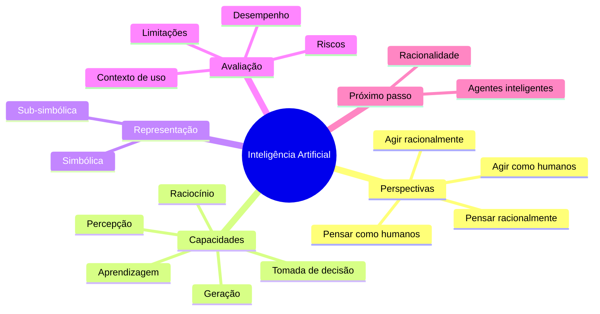
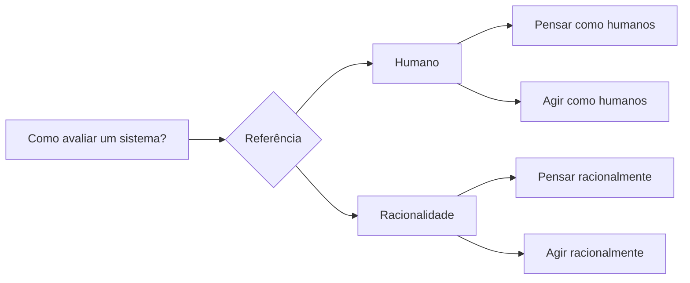
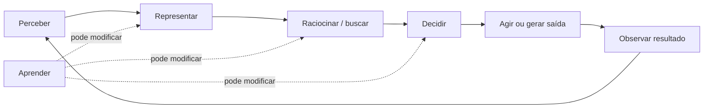
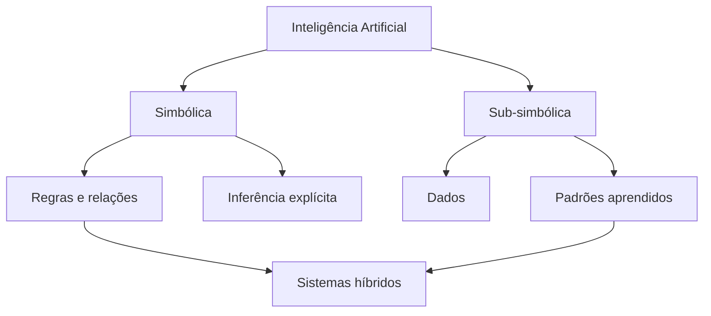
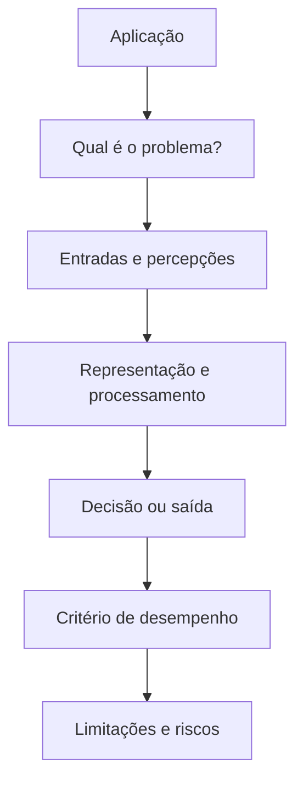
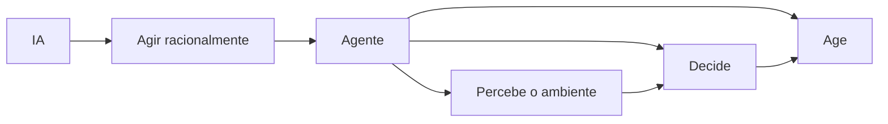

# Aula 01 - Introdução à Inteligência Artificial

> **Guia visual de revisão.** Use esta nota depois da aula para reorganizar os conceitos antes do estudo guiado e da atividade. O objetivo não é substituir os slides, mas transformar o conteúdo em um mapa de relações.

## Visão em 30 segundos

| Pergunta | Ideia-chave |
|---|---|
| O que é IA? | Uma área que estuda e constrói sistemas capazes de realizar tarefas associadas a capacidades inteligentes. |
| Existe uma única definição? | Não. A área pode ser analisada pelo comportamento humano, pelos processos humanos, pela racionalidade do raciocínio ou pela racionalidade da ação. |
| IA é sinônimo de aprendizado de máquina? | Não. Aprendizado é uma das capacidades e abordagens presentes na área. |
| Alto desempenho significa inteligência geral? | Não. Um sistema pode ser excelente em uma tarefa específica e ainda ter limitações importantes fora daquele contexto. |
| Qual conceito prepara a próxima aula? | **Racionalidade**, que será central para entender agentes inteligentes. |

## Mapa mental da aula



## 1. Quatro formas clássicas de olhar para IA

A diferença entre as quatro perspectivas está principalmente em **qual referência usamos para dizer que um sistema é inteligente**.

| Perspectiva | Pergunta central | Foco da avaliação |
|---|---|---|
| **Pensar como humanos** | O sistema reproduz processos cognitivos humanos? | Modelagem do processo de pensamento. |
| **Agir como humanos** | O comportamento produzido se aproxima do comportamento humano? | Resultado observável da interação. |
| **Pensar racionalmente** | O raciocínio segue princípios que conduzem a conclusões adequadas? | Correção do processo de inferência. |
| **Agir racionalmente** | O sistema escolhe ações adequadas para atingir objetivos? | Decisão e desempenho esperado. |



> **Ponto de atenção:** imitar um comportamento humano não prova que o sistema raciocina como um humano. Da mesma forma, agir racionalmente não exige reproduzir os mecanismos cognitivos humanos.

## 2. IA como conjunto de capacidades

É mais útil analisar **o que o sistema precisa fazer** do que apenas perguntar se determinada tecnologia "é IA".



Capacidades recorrentes:

- **percepção** - obter informação do ambiente;
- **representação** - organizar internamente informações relevantes;
- **raciocínio** - relacionar informações e derivar consequências;
- **busca e planejamento** - explorar alternativas para atingir uma meta;
- **aprendizagem** - modificar comportamento ou representação a partir de dados e experiência;
- **decisão** - escolher uma ação entre alternativas;
- **geração** - produzir texto, imagem, código ou outra saída estruturada.

## 3. Simbólico e sub-simbólico

As duas famílias não devem ser tratadas como rivais absolutas. Elas representam formas diferentes de organizar conhecimento e processamento.

| Aspecto | Abordagem simbólica | Abordagem sub-simbólica |
|---|---|---|
| Representação | símbolos, regras e relações explícitas | parâmetros, vetores e representações distribuídas |
| Conhecimento | mais diretamente inspecionável | frequentemente aprendido a partir de dados |
| Explicação | pode ser mais direta | pode exigir técnicas adicionais de interpretação |
| Aprendizagem | não é obrigatória | frequentemente central |
| Uso | raciocínio explícito, regras, conhecimento estruturado | percepção, reconhecimento de padrões, aprendizagem estatística |



> **Evite a simplificação:** "IA moderna é somente aprendizado de máquina". A disciplina mostrará busca, representação, lógica, aprendizagem e métodos inspirados na natureza como partes de um repertório maior.

## 4. Automação, adaptação e comportamento inteligente

Nem toda automação precisa ser classificada como IA. Uma boa análise considera o problema, a representação utilizada e o modo como o sistema decide.

```text
Automação simples
    ↓
regras fixas para situações previstas
    ↓
comportamento adaptativo
    ↓
ajuste diante de dados, contexto ou experiência
    ↓
decisão em ambientes com alternativas e incerteza
```

Perguntas úteis ao analisar um sistema:

1. Qual problema está sendo resolvido?
2. Quais informações entram no sistema?
3. Que representação é utilizada?
4. O sistema precisa escolher entre alternativas?
5. Há aprendizagem ou adaptação?
6. Existe uma medida de desempenho?
7. Quais limites de operação foram assumidos?

## 5. Desempenho não é compreensão geral

Um sistema pode apresentar ótimo desempenho em uma tarefa e ainda:

- falhar quando o contexto muda;
- depender de dados ou instruções específicas;
- não transferir conhecimento para outra tarefa;
- produzir respostas plausíveis, mas incorretas;
- não possuir autonomia para agir no ambiente;
- não ter acesso às informações necessárias para uma decisão.

> **Regra prática:** avalie a capacidade demonstrada e o contexto em que ela foi medida. Evite transformar desempenho específico em afirmações gerais sobre inteligência.

## 6. Como analisar uma aplicação de IA

Use este pequeno roteiro:



### Exemplo de categorias para classificação

| Elemento | Pergunta de revisão |
|---|---|
| Problema | O que precisa ser resolvido? |
| Entrada | O que o sistema observa ou recebe? |
| Saída | O que ele produz ou executa? |
| Capacidade central | Percepção, busca, raciocínio, aprendizagem, geração ou recomendação? |
| Perspectiva | Humana ou racional? Pensamento ou ação? |
| Limitação | Em que situação a capacidade deixa de ser confiável? |

## 7. Erros conceituais frequentes

> ⚠️ **"IA é qualquer programa complexo."** Complexidade de código não define inteligência.

> ⚠️ **"IA é apenas aprendizado de máquina."** Aprendizado é uma parte da área, não a área inteira.

> ⚠️ **"Se parece humano, pensa como humano."** Sem evidência sobre o processo interno, essa conclusão não é válida.

> ⚠️ **"Se acertou muito, entende o problema de forma geral."** Desempenho em uma tarefa não implica generalização irrestrita.

> ⚠️ **"Racionalidade significa sempre acertar."** A decisão racional depende das informações disponíveis e do critério de desempenho.

## 8. Ponte para a Aula 02

A perspectiva **agir racionalmente** leva diretamente ao conceito de agente.



Na próxima aula, a pergunta deixa de ser apenas **"o que é inteligência?"** e passa a ser:

> **Como descrever um sistema que percebe um ambiente e escolhe ações para atingir objetivos?**

## Revisão de 1 minuto

```text
IA
├── pode ser definida por referência ao humano ou à racionalidade
├── pode enfatizar pensamento ou ação
├── reúne capacidades como percepção, representação, raciocínio e aprendizagem
├── pode usar representações simbólicas, sub-simbólicas ou híbridas
├── deve ser avaliada no contexto de uma tarefa e de uma medida de desempenho
└── prepara o conceito de agente racional
```

## Checklist

- [ ] Diferencio as quatro perspectivas clássicas.
- [ ] Consigo explicar por que IA não é sinônimo de aprendizado de máquina.
- [ ] Consigo distinguir comportamento observado de processo interno.
- [ ] Consigo analisar uma aplicação por problema, entrada, saída e desempenho.
- [ ] Consigo explicar por que desempenho específico não implica inteligência geral.
- [ ] Consigo relacionar racionalidade à próxima aula sobre agentes.

**Próximo passo:** faça o [Estudo Guiado 01](../../estudos-guiados/01-introducao/README.md) e depois retorne aos slides para revisar os pontos em que sua explicação ainda estiver imprecisa.
