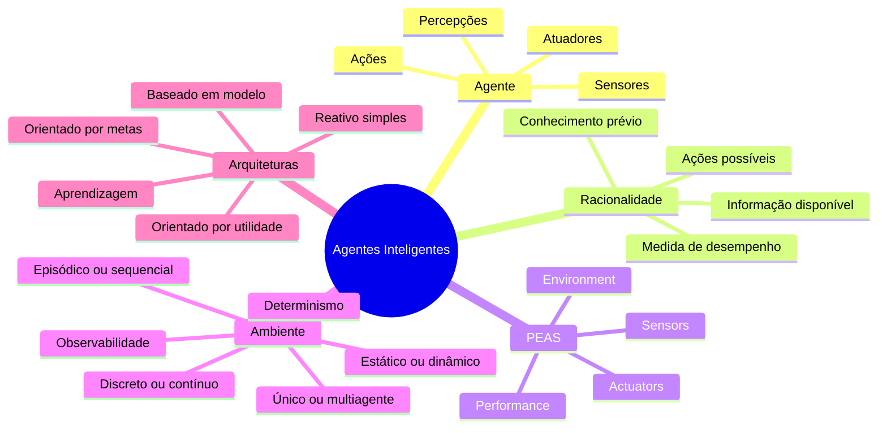
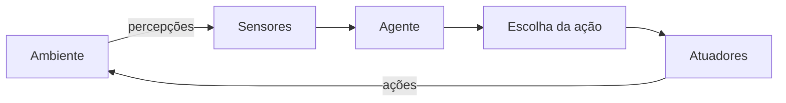
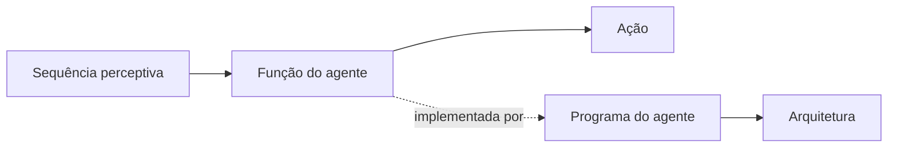
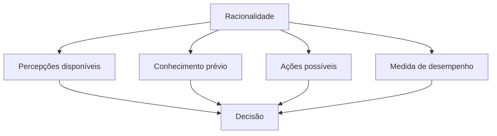
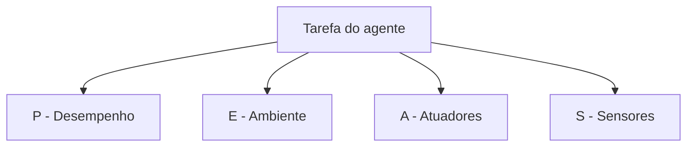
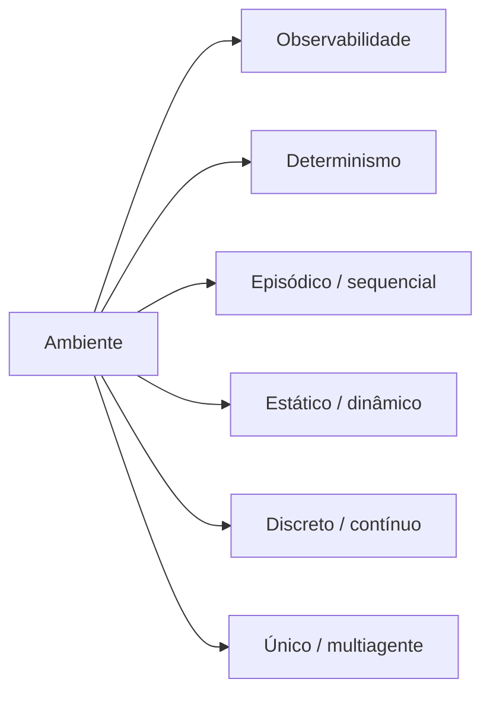
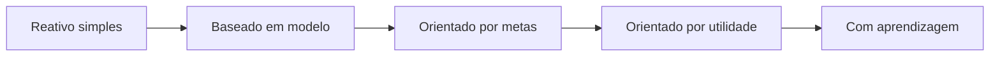
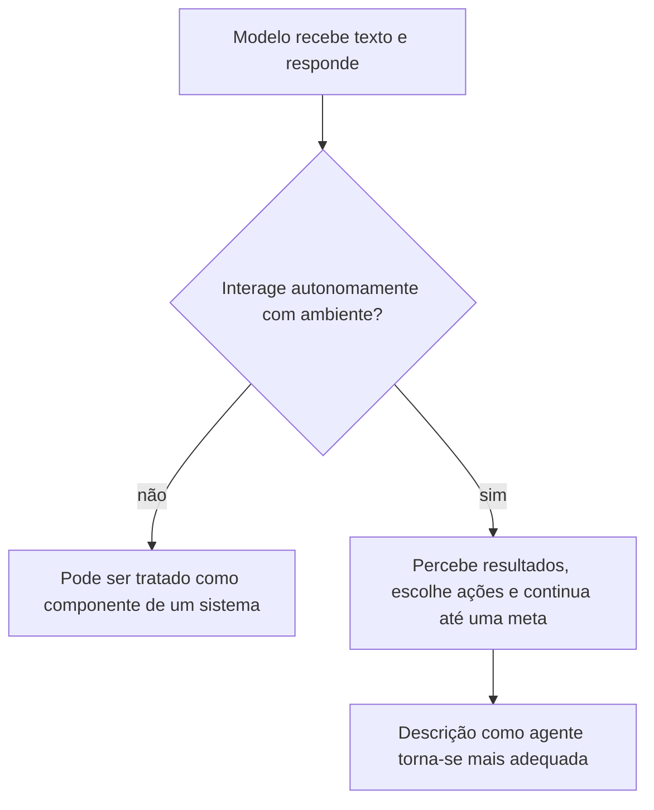
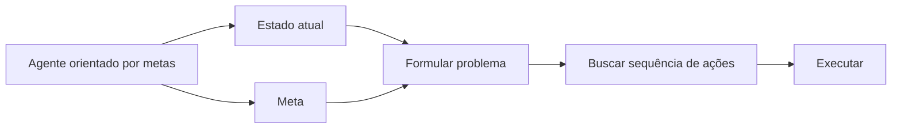

# Aula 02 - Agentes Inteligentes

> **Guia visual de revisão.** Esta nota organiza os conceitos de agente, racionalidade, PEAS, propriedades do ambiente e arquiteturas de agentes. Use-a como ponte entre os slides e o Estudo Guiado 02.

## Visão em 30 segundos

| Pergunta | Ideia-chave |
|---|---|
| O que é um agente? | Uma entidade que percebe um ambiente e age sobre ele. |
| O que torna um agente racional? | Escolher a ação que maximiza o desempenho esperado com base nas percepções, conhecimento e ações disponíveis. |
| Racionalidade é onisciência? | Não. Uma decisão pode ser racional mesmo quando o resultado posterior não é o melhor possível. |
| Para que serve PEAS? | Para especificar tarefa, ambiente, meios de atuação e fontes de percepção. |
| Por que classificar o ambiente? | Porque observabilidade, incerteza, dinâmica e continuidade influenciam a arquitetura do agente. |

## Mapa mental da aula



## 1. O ciclo percepção-ação

A forma mais direta de visualizar um agente é como um ciclo contínuo entre ambiente, percepção, decisão e ação.



### Termos que não são sinônimos

| Termo | Significado |
|---|---|
| **Sensor** | mecanismo ou fonte usada para captar informação |
| **Percepção** | informação recebida em determinado instante |
| **Sequência perceptiva** | histórico das percepções recebidas |
| **Ação** | decisão executada pelo agente |
| **Atuador** | meio utilizado para produzir a ação no ambiente |

> **Ponto de atenção:** sensor não é percepção, assim como atuador não é ação.

## 2. Função do agente e programa do agente

A **função do agente** descreve conceitualmente o mapeamento entre sequência perceptiva e ação.

```text
sequência de percepções → ação
```

O **programa do agente** é a implementação concreta dessa função em uma arquitetura computacional.



## 3. Racionalidade

Um agente racional escolhe a ação que **maximiza o desempenho esperado**, considerando:

- a medida de desempenho;
- a sequência perceptiva disponível;
- o conhecimento prévio sobre o ambiente;
- as ações que podem ser executadas.



### Racionalidade ≠ onisciência

Considere duas ideias:

```text
Onisciência: saber antecipadamente o resultado real de cada ação.
Racionalidade: decidir da melhor forma possível com o que se sabe agora.
```

Uma decisão racional pode produzir um resultado ruim se o ambiente for incerto ou parcialmente observável.

> **Regra de análise:** julgue a decisão pelas informações disponíveis no momento em que ela foi tomada, não apenas pelo resultado observado depois.

## 4. PEAS

PEAS ajuda a especificar uma tarefa de agente de forma disciplinada.

| Letra | Elemento | Pergunta |
|---|---|---|
| **P** | Performance measure | Como saberemos se o agente está indo bem? |
| **E** | Environment | Em que ambiente ele opera? |
| **A** | Actuators | Como ele age sobre o ambiente? |
| **S** | Sensors | Como ele percebe o ambiente? |



### Exemplo genérico: robô de entrega

| PEAS | Possíveis elementos |
|---|---|
| P | segurança, tempo de entrega, energia, taxa de sucesso |
| E | corredores, pessoas, portas, elevadores, obstáculos |
| A | motores, direção, sinalização, manipuladores |
| S | câmera, distância, localização, estado de bateria |

> **Evite medidas vagas:** "fazer um bom trabalho" não especifica desempenho. Prefira critérios observáveis e comparáveis.

## 5. Como classificar um ambiente

As propriedades do ambiente ajudam a definir quanta informação o agente precisa manter e como deve escolher suas ações.



### Quadro de revisão

| Dimensão | Extremo A | Extremo B | Pergunta útil |
|---|---|---|---|
| Observabilidade | completamente observável | parcialmente observável | o agente vê tudo que importa? |
| Resultado das ações | determinístico | estocástico | a mesma ação sempre produz o mesmo resultado? |
| Dependência temporal | episódico | sequencial | decisões atuais afetam decisões futuras? |
| Mudança do ambiente | estático | dinâmico | o mundo muda enquanto o agente decide? |
| Representação | discreto | contínuo | estados, tempo e ações assumem valores discretos? |
| Participantes | agente único | multiagente | outros agentes influenciam o resultado? |

> **Importante:** uma classificação depende da modelagem adotada. Alterar hipóteses do problema pode alterar a classificação.

## 6. Arquiteturas de agentes

As arquiteturas podem ser vistas como respostas progressivas a limitações do agente mais simples.



### Comparação

| Arquitetura | Usa estado interno? | Usa meta? | Usa utilidade? | Pode aprender? |
|---|---:|---:|---:|---:|
| Reativo simples | não necessariamente | não | não | não necessariamente |
| Baseado em modelo | sim | não | não | não necessariamente |
| Orientado por metas | sim | sim | não necessariamente | não necessariamente |
| Orientado por utilidade | sim | sim | sim | não necessariamente |
| Com aprendizagem | depende da arquitetura base | pode usar | pode usar | sim |

### O raciocínio por trás da evolução

```text
Só reagir ao presente
    ↓
lembrar aspectos não observados diretamente
    ↓
considerar objetivos futuros
    ↓
comparar alternativas por preferência/desempenho
    ↓
aprender com experiência
```

## 7. ChatGPT é um agente?

A resposta depende da **configuração do sistema**, não apenas do modelo.



### Dois cenários

| Cenário | Percepção | Ação | Autonomia | Interpretação |
|---|---|---|---|---|
| modelo responde a uma mensagem | prompt | resposta | baixa | componente interativo |
| sistema observa, usa ferramentas, verifica e continua | mensagens + resultados | chamadas de ferramentas + respostas | maior | arquitetura de agente |

> **Ponto central:** não classifique apenas pelo nome da tecnologia. Identifique ambiente, percepções, ações, objetivo e grau de autonomia.

## 8. Agente orientado por metas e busca

Um agente orientado por metas precisa considerar **estados futuros** e **sequências de ações**.



Essa transição prepara diretamente as Aulas 03 e 04.

## 9. Erros conceituais frequentes

> ⚠️ **"Agente é qualquer programa."** A análise por agentes enfatiza percepção, ação e relação com um ambiente.

> ⚠️ **"Racionalidade significa sempre escolher a ação que dará o melhor resultado real."** Isso exigiria conhecimento perfeito do futuro.

> ⚠️ **"Parcialmente observável significa que o sensor está com defeito."** A própria natureza do problema pode impedir acesso completo ao estado relevante.

> ⚠️ **"Agente orientado por metas sempre sabe o melhor caminho."** A meta define o que se deseja; encontrar como chegar até ela pode exigir busca.

## Revisão de 1 minuto

```text
Agente
├── percebe o ambiente por sensores
├── recebe percepções
├── escolhe ações
├── atua por atuadores
├── é avaliado por uma medida de desempenho
├── pode operar sob informação incompleta
└── pode usar modelos, metas, utilidade e aprendizagem
```

## Checklist

- [ ] Diferencio sensor, percepção, ação e atuador.
- [ ] Consigo explicar racionalidade sem confundir com onisciência.
- [ ] Consigo montar um PEAS coerente.
- [ ] Consigo classificar um ambiente e justificar cada dimensão.
- [ ] Consigo comparar as principais arquiteturas de agentes.
- [ ] Consigo analisar quando um sistema baseado em modelo de linguagem pode ser tratado como agente.
- [ ] Consigo explicar por que agentes orientados por metas levam à formulação de problemas e busca.

**Próximo passo:** faça o [Estudo Guiado 02](../../estudos-guiados/02-agentes/README.md) e observe como as perguntas sobre estado, meta e consequências das ações conduzem à Aula 03.
