# Aula 03 - Representação do Conhecimento e Solução de Problemas

> **Guia visual de revisão.** Esta nota organiza a passagem entre agentes orientados por metas e problemas de busca: representação, abstração, estados, ações, transições, meta, espaço de estados, árvore de busca e fronteira.

## Visão em 30 segundos

| Pergunta | Ideia-chave |
|---|---|
| Por que representar conhecimento? | Para transformar aspectos relevantes do mundo em estruturas que possam ser consultadas, relacionadas e manipuladas computacionalmente. |
| O que é abstração? | Escolher quais detalhes do domínio são relevantes para o problema e quais podem ser omitidos. |
| O que compõe um problema de busca? | Estado inicial, estados, ações, transições, teste de objetivo e, quando aplicável, custos. |
| Estado e nó são a mesma coisa? | Não. Estado pertence ao problema; nó pertence ao processo de busca e pode guardar pai, ação, profundidade e custo. |
| Qual conceito prepara a Aula 04? | A **fronteira**, porque diferentes estratégias escolhem de forma diferente qual nó expandir em seguida. |

## Mapa mental da aula

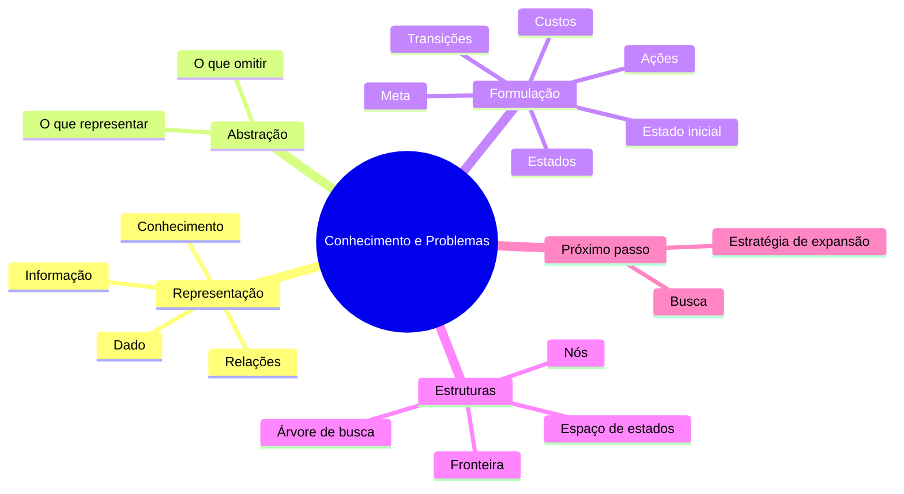

## 1. Dado, informação, conhecimento e representação

Uma forma útil de organizar os conceitos é pensar em níveis de interpretação.

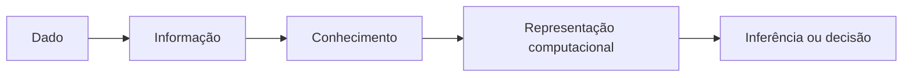

### Exemplo conceitual

```text
42
↓
"temperatura atual = 42 °C"
↓
"essa temperatura está acima da faixa operacional segura"
↓
regra, relação, atributo, vetor ou outra estrutura computável
↓
acionar uma decisão
```

> **Ponto central:** a representação não é uma cópia neutra do mundo. Ela é uma escolha de projeto.

## 2. Representar é escolher

Qualquer representação enfatiza alguns aspectos e omite outros.

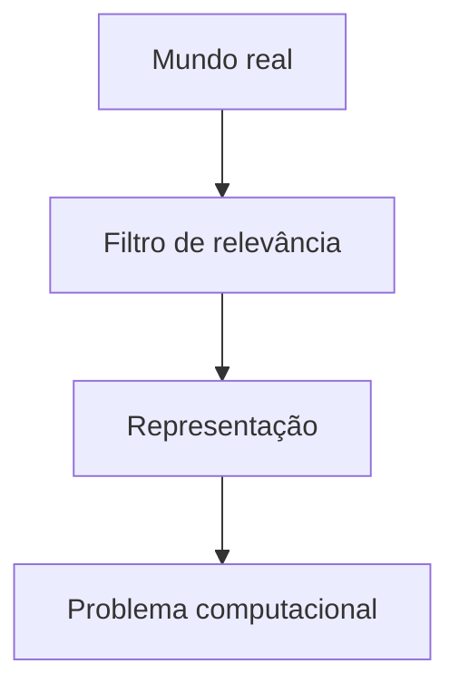

Perguntas para avaliar uma representação:

- quais objetos precisam existir na representação?
- quais propriedades desses objetos importam?
- quais relações precisam ser preservadas?
- que detalhes podem ser ignorados sem comprometer a meta?
- a representação permite calcular sucessores e reconhecer a meta?

## 3. Abstração

Considere um problema de navegação entre prédios.

### Representação detalhada

```text
posição contínua + orientação + velocidade + obstáculos + geometria completa
```

### Representação abstrata

```text
Prédio A ── Prédio B ── Prédio C
   │            │
Prédio D ── Prédio E
```

A segunda representação pode ser suficiente se o objetivo for apenas decidir uma sequência de prédios, mas pode ser insuficiente se o problema exigir trajetória física precisa.

| Mais detalhe | Mais abstração |
|---|---|
| maior fidelidade | menor espaço de representação |
| maior custo de processamento | foco no que importa para a meta |
| mais variáveis | menos variáveis |
| pode capturar restrições finas | pode ocultar restrições importantes |

> **Boa abstração:** elimina detalhes irrelevantes sem eliminar informações necessárias para resolver o problema.

## 4. Formulação de um problema

Antes de escolher qualquer algoritmo, formule corretamente o problema.

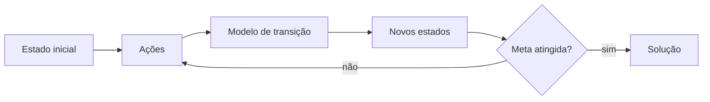

### Componentes fundamentais

| Componente | Pergunta |
|---|---|
| **Estado inicial** | de onde o problema começa? |
| **Estados** | como representar uma configuração possível? |
| **Ações** | o que pode ser feito em cada estado? |
| **Transição / sucessor** | qual estado resulta de uma ação? |
| **Teste de objetivo** | como reconhecer uma solução? |
| **Custo de ação** | quanto custa executar uma ação? |
| **Custo de caminho** | quanto custou a sequência completa? |

## 5. Exemplo: navegação em salas

Considere:

```text
Sala A ── Sala B ── Sala C
  │          │
Sala D ── Sala E
```

Uma formulação possível:

| Elemento | Representação |
|---|---|
| estado | sala atual |
| estado inicial | Sala A |
| ações | mover para uma sala adjacente |
| transição | posição passa para a sala escolhida |
| objetivo | chegar à Sala C |
| custo | 1 por movimento, ou outro valor definido pelo problema |

Observe que **a formulação não escolhe ainda BFS, DFS ou A***. Ela apenas descreve o problema.

## 6. Estado não é nó

Essa distinção é essencial.

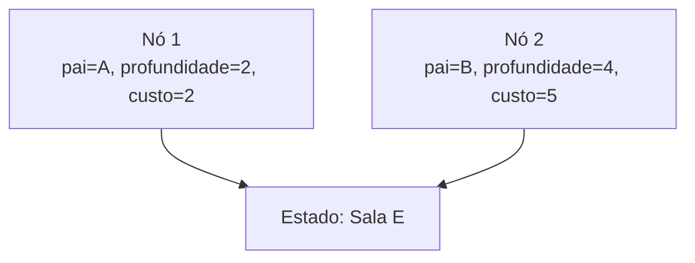

O mesmo estado pode ser alcançado por caminhos diferentes.

### Estado

Representa uma configuração do problema.

### Nó

É uma estrutura usada pelo algoritmo de busca e pode armazenar:

- estado;
- nó pai;
- ação usada para chegar ali;
- profundidade;
- custo acumulado `g(n)`;
- outras informações necessárias à estratégia.

> **Erro comum:** confundir "estado já existe no domínio" com "nó já foi gerado pela busca".

## 7. Espaço de estados x árvore de busca

### Espaço de estados

Representa **as configurações possíveis e suas transições**.

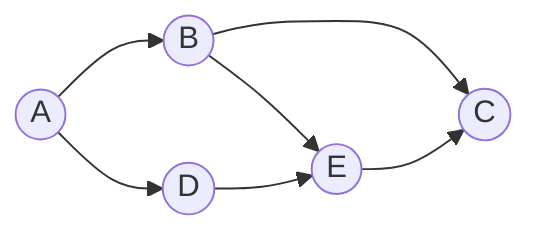

### Árvore de busca

Representa **como um algoritmo explora caminhos a partir do estado inicial**.

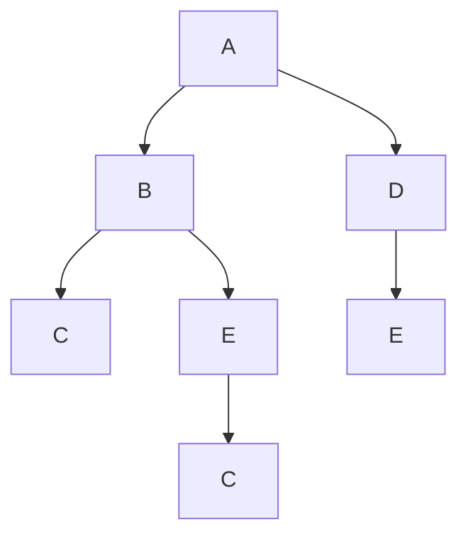

O estado `E` aparece em mais de um nó porque pode ser alcançado por trajetórias diferentes.

| Espaço de estados | Árvore de busca |
|---|---|
| descreve o problema | descreve a exploração |
| estado é entidade central | nó é entidade central |
| pode conter ciclos | a árvore representa caminhos gerados |
| independente da estratégia | depende da ordem e das decisões da busca |

## 8. Gerar, inserir e expandir

Os termos precisam ser separados.

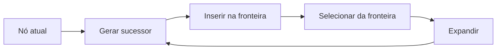

- **gerar:** produzir um sucessor candidato;
- **inserir na fronteira:** torná-lo disponível para futura seleção;
- **selecionar:** retirar um nó conforme a estratégia;
- **expandir:** executar a função sucessora sobre o nó selecionado.

Essa distinção será importante ao comparar métricas dos algoritmos.

## 9. A fronteira

A fronteira contém nós já gerados que ainda podem ser escolhidos para expansão.

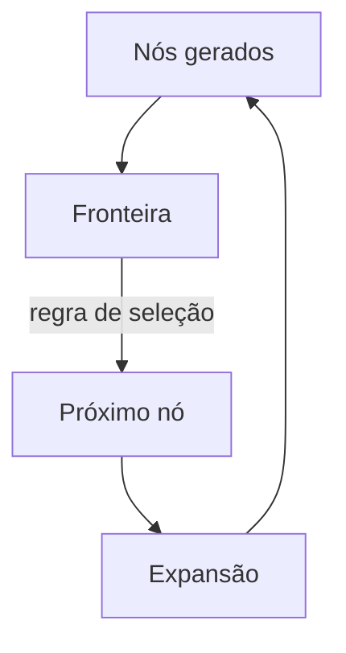

A grande ideia que prepara a próxima aula é:

> **Se mudarmos apenas a regra de seleção da fronteira, mudamos a estratégia de busca.**

### Três exemplos de regra

| Regra | Comportamento esperado |
|---|---|
| primeiro que entrou | prioriza nós mais antigos na fronteira |
| último que entrou | prioriza o ramo mais recentemente aprofundado |
| menor prioridade numérica | prioriza um critério como custo ou heurística |

## 10. Busca em árvore e busca em grafo

Quando estados podem ser revisitados, controlar estados já conhecidos evita repetir trabalho indefinidamente.

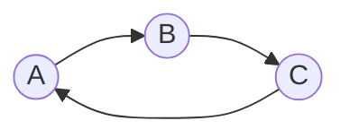

Sem algum controle, o ciclo `A → B → C → A` pode gerar expansões repetidas.

A busca em grafo introduz mecanismos para acompanhar estados já vistos ou explorados. A forma exata desse controle depende do algoritmo e das regras adotadas.

> **Ponto de atenção:** evitar repetição não significa simplesmente "ignorar tudo que já apareceu". Em estratégias baseadas em custo, um caminho melhor para um estado conhecido pode ser relevante.

## 11. Da formulação para a busca

A sequência conceitual das aulas pode ser visualizada assim:

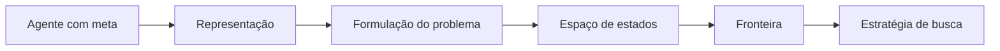

A pergunta da Aula 03 é:

> **Como representar o problema?**

A pergunta da Aula 04 será:

> **Qual nó da fronteira deve ser expandido em seguida?**

## 12. Erros conceituais frequentes

> ⚠️ **"Quanto mais detalhada a representação, melhor."** Detalhe desnecessário aumenta o espaço de estados e o custo de solução.

> ⚠️ **"Estado e nó são a mesma coisa."** Um nó contém um estado, mas também informações sobre o caminho da busca.

> ⚠️ **"A árvore de busca é o próprio espaço de estados."** A árvore é uma estrutura gerada durante a exploração.

> ⚠️ **"Escolher o algoritmo vem antes de formular o problema."** Uma formulação ruim não é corrigida por um algoritmo mais sofisticado.

> ⚠️ **"Se um estado apareceu uma vez, qualquer nova ocorrência pode ser descartada."** Estratégias baseadas em custo podem precisar considerar melhorias.

## Revisão de 1 minuto

```text
Agente com meta
↓
representa o domínio
↓
escolhe uma abstração
↓
formula estados, ações, transições, meta e custos
↓
constrói/explora um espaço de estados
↓
gera nós de busca
↓
mantém uma fronteira
↓
precisa decidir qual nó expandir
```

## Checklist

- [ ] Consigo explicar por que representação é uma escolha de projeto.
- [ ] Consigo explicar o papel da abstração.
- [ ] Consigo formular um problema antes de escolher o algoritmo.
- [ ] Diferencio estado de nó.
- [ ] Diferencio espaço de estados de árvore de busca.
- [ ] Diferencio gerar, inserir, selecionar e expandir.
- [ ] Consigo explicar o papel da fronteira.
- [ ] Consigo explicar por que a regra de seleção da fronteira define estratégias diferentes.

**Próximo passo:** faça o [Estudo Guiado 03](../../estudos-guiados/03-conhecimento/README.md). Quando estiver confortável com fronteira, custo e expansão, avance para as estratégias da Aula 04.
