# Aula 04 - Estruturas e Estratégias de Busca

> **Guia visual de revisão.** Esta nota organiza a Aula 04 em três blocos: busca não informada, busca informada e busca local/ambientes complexos. Use-a como mapa mental para comparar estratégias sem confundir critério de seleção, custo, heurística, completude e otimalidade.

## Visão em 30 segundos

| Estratégia | Ideia central |
|---|---|
| BFS | expande primeiro os nós mais rasos |
| DFS | aprofunda um ramo antes de retornar |
| UCS | escolhe o menor custo acumulado `g(n)` |
| Gulosa | escolhe o menor valor heurístico `h(n)` |
| A* | combina custo acumulado e estimativa: `f(n)=g(n)+h(n)` |
| Hill Climbing | move para um vizinho localmente melhor |
| Simulated Annealing | aceita ocasionalmente movimentos piores para escapar de ótimos locais |
| Beam Search | mantém apenas um conjunto limitado de candidatos |
| Algoritmo Genético | evolui uma população de soluções candidatas |

## Mapa mental da aula

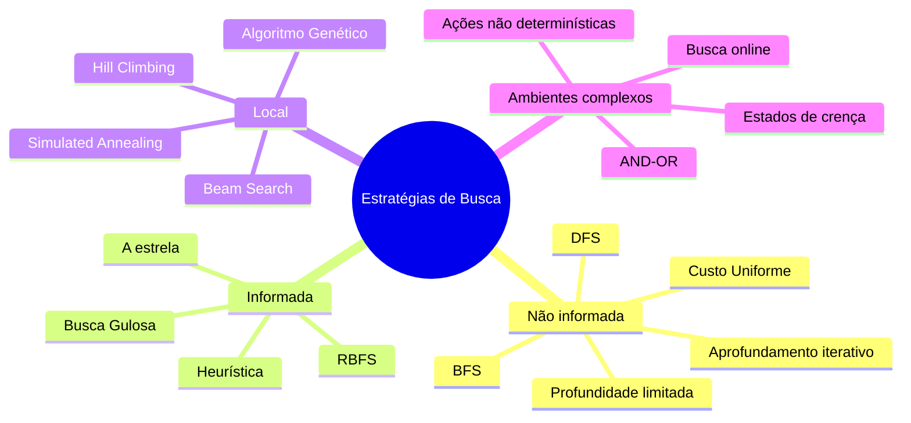

## 1. A pergunta que diferencia as estratégias

A estrutura geral permanece parecida:

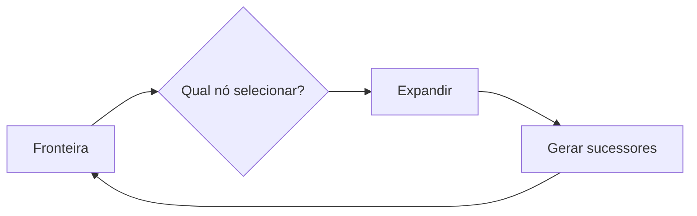

A diferença central está no **critério de seleção da fronteira**.

## 2. Quadro comparativo principal

| Estratégia | Seleção da fronteira | `g(n)` | `h(n)` | Intuição |
|---|---|---:|---:|---|
| BFS | menor profundidade / FIFO | não | não | explorar por camadas |
| DFS | maior profundidade / LIFO | não | não | seguir um ramo |
| UCS | menor `g(n)` | sim | não | priorizar caminho já mais barato |
| Gulosa | menor `h(n)` | não | sim | aproximar-se rapidamente da meta |
| A* | menor `f(n)=g(n)+h(n)` | sim | sim | equilibrar custo passado e estimativa futura |

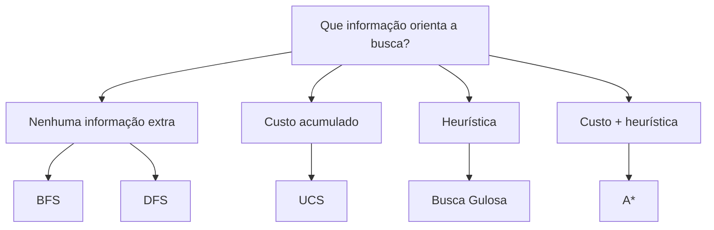

## 3. Busca em Largura - BFS

A BFS prioriza nós de menor profundidade.

```text
nível 0 → nível 1 → nível 2 → nível 3 → ...
```

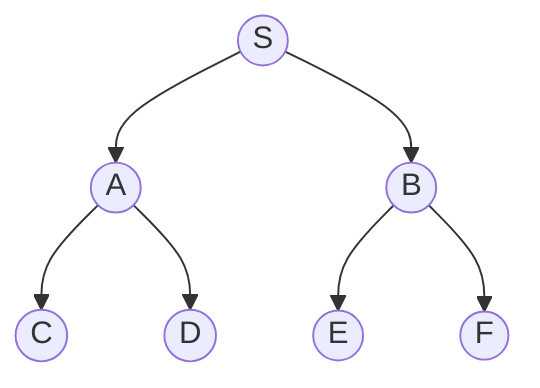

Ordem típica por camadas:

```text
S → A, B → C, D, E, F
```

### Pontos-chave

- completa em condições usuais de espaço finito ou fator de ramificação finito;
- ótima quando todos os custos de passo são iguais;
- pode consumir muita memória porque mantém uma fronteira larga;
- encontrar a meta na fronteira não é necessariamente o mesmo que selecioná-la para expansão, dependendo da especificação adotada.

> **Erro comum:** dizer que BFS é sempre ótima. Ela é ótima em número de passos quando os custos são uniformes.

## 4. Busca em Profundidade - DFS

A DFS prioriza o nó mais recentemente inserido, aprofundando um ramo.

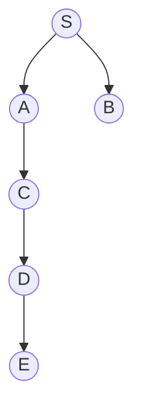

Intuição:

```text
S → A → C → D → E
            ↑
       volta quando necessário
```

### Pontos-chave

- usa pouca memória em comparação com BFS em muitos cenários;
- pode se perder em ramos profundos ou ciclos;
- não garante a solução mais rasa;
- a ordem de geração dos sucessores influencia fortemente o percurso.

> **Ponto de atenção:** "DFS é mais rápida" não é uma propriedade geral. O desempenho depende da posição da solução e da estrutura do espaço.

## 5. Profundidade limitada e aprofundamento iterativo

A busca em profundidade limitada introduz um limite `L`.

```text
DFS + profundidade máxima L
```

O aprofundamento iterativo repete buscas com limites crescentes:

```text
L=0 → L=1 → L=2 → L=3 → ...
```

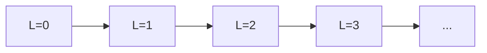

A ideia é combinar a economia de memória da busca em profundidade com a exploração sistemática por níveis.

## 6. Busca de Custo Uniforme - UCS

A UCS seleciona o nó com menor custo acumulado:

```text
g(n)
```

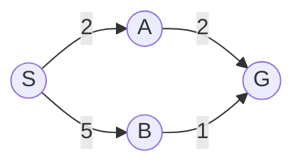

Mesmo que um caminho tenha menos passos, ele pode custar mais.

| Caminho | Passos | Custo |
|---|---:|---:|
| `S → A → G` | 2 | 4 |
| `S → B → G` | 2 | 6 |

### Pontos-chave

- prioriza custo, não profundidade;
- com custos positivos adequados, possui garantia de otimalidade;
- um estado conhecido pode precisar ser atualizado se surgir um caminho de menor custo;
- entradas antigas em fila de prioridade podem se tornar obsoletas.

> **Conexão com o Trabalho 01:** a definição de geração, expansão, reinserção e entrada obsoleta precisa ser seguida exatamente conforme o enunciado.

## 7. Heurísticas

Uma heurística estima o custo restante até a meta:

```text
h(n) ≈ custo de n até a meta
```

```mermaid
flowchart LR
    N((n)) -->|custo já pago = g(n)| P[passado]
    N -->|estimativa = h(n)| G((meta))
```

### Heurística não é custo real

| Termo | Significado |
|---|---|
| `g(n)` | custo real acumulado até `n` |
| `h(n)` | estimativa do custo restante |
| `f(n)` | estimativa do custo total via `n` |

## 8. Admissibilidade e consistência

### Admissibilidade

Uma heurística admissível não superestima o custo real mínimo até a meta:

```text
h(n) ≤ h*(n)
```

onde `h*(n)` representa o custo real ótimo restante.

### Consistência

A estimativa deve respeitar uma forma de desigualdade triangular ao longo das transições:

```text
h(n) ≤ c(n,n') + h(n')
```

```mermaid
flowchart LR
    N((n)) -->|c(n,n')| NP((n'))
    NP -->|h(n')| G((meta))
    N -. h(n) não deve ultrapassar esse caminho estimado .-> G
```

> **Não memorize isoladamente:** admissibilidade limita a superestimação em relação à meta; consistência controla a coerência da estimativa entre estados vizinhos.

## 9. Busca Gulosa

A Busca Gulosa escolhe o menor:

```text
h(n)
```

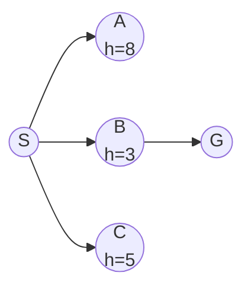

Ela tende a escolher `B` porque parece mais próxima da meta.

### Vantagem

Pode direcionar rapidamente a exploração.

### Limitação

Ignora o custo já pago:

```text
prioridade = h(n)
```

Portanto, uma direção aparentemente promissora pode levar a um caminho globalmente caro.

## 10. A*

A* combina passado e futuro:

```text
f(n) = g(n) + h(n)
```

```mermaid
flowchart TB
    N((n)) --> G1[g(n)<br/>custo acumulado]
    N --> H1[h(n)<br/>estimativa restante]
    G1 --> F[f(n)]
    H1 --> F
```

### Casos úteis para compreender A*

```text
h(n)=0 para todos os nós
→ A* se comporta como UCS
```

Quanto mais informativa for uma heurística adequada, mais a busca pode evitar expansões desnecessárias.

> **Erro comum:** "A* sempre é ótima". A propriedade depende das condições da heurística e da forma de implementação da busca.

## 11. Comparação visual: BFS, UCS, Gulosa e A*

```mermaid
flowchart TD
    Q[O que a estratégia considera?]
    Q --> BFS[BFS<br/>profundidade]
    Q --> UCS[UCS<br/>g(n)]
    Q --> GREEDY[Gulosa<br/>h(n)]
    Q --> ASTAR[A*<br/>g(n)+h(n)]
```

| Situação | Estratégia a considerar primeiro |
|---|---|
| custos iguais e solução mais rasa | BFS |
| custos diferentes e sem heurística | UCS |
| heurística disponível e rapidez mais importante que otimalidade | Gulosa |
| heurística adequada e custo da solução importante | A* |
| memória muito limitada e qualquer solução pode bastar | DFS, dependendo do espaço |

## 12. Busca local: mudança de perspectiva

Na busca clássica, normalmente queremos um **caminho** do estado inicial até a meta.

Na busca local, muitas vezes interessa principalmente a **qualidade do estado atual**.

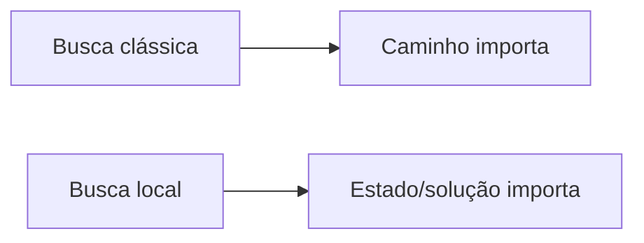

Exemplos de aplicação incluem problemas de otimização em que uma configuração completa já representa uma solução candidata.

## 13. Hill Climbing

Hill Climbing move-se para um vizinho considerado melhor segundo uma função de avaliação.

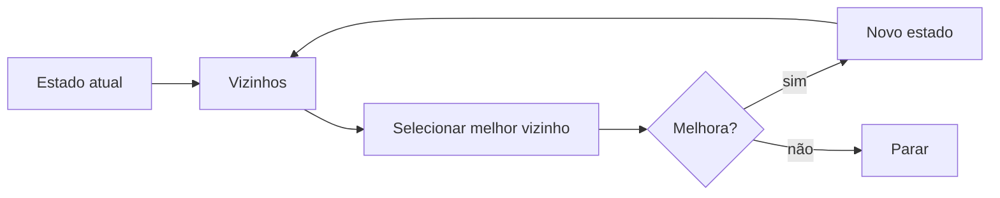

### Problemas típicos

- ótimo local;
- platô;
- crista ou região de progresso difícil.

```text
qualidade
  ^          /
  |     ____/ \__ ótimo global
  | ___/          
  |/  ótimo local
  +-----------------> estados
```

### Random Restart

Executa Hill Climbing a partir de diferentes estados iniciais.

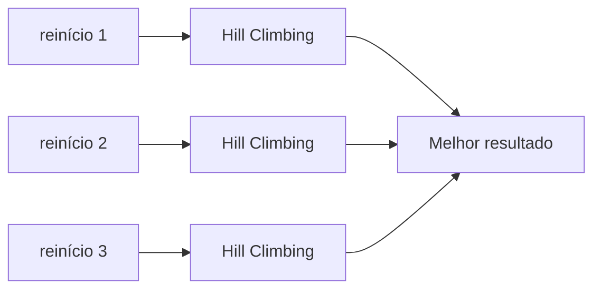

## 14. Simulated Annealing

Simulated Annealing permite ocasionalmente aceitar movimentos piores.

A probabilidade dessa aceitação diminui conforme a "temperatura" cai.

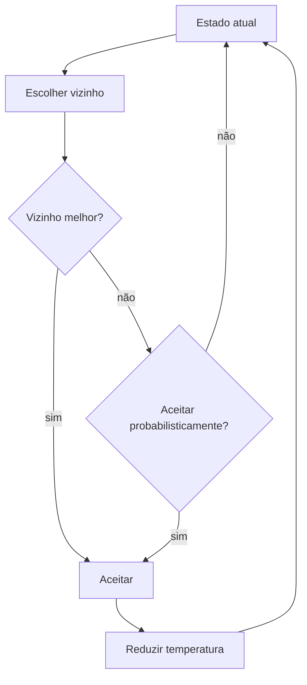

Intuição:

```text
início: mais exploração
↓
temperatura cai
↓
menos aceitação de movimentos piores
↓
mais exploração local
```

## 15. Beam Search

Beam Search mantém apenas um número limitado de candidatos por etapa.

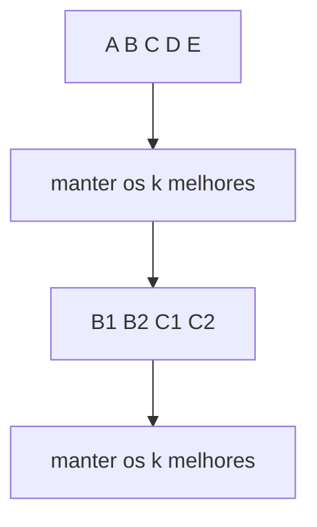

O parâmetro `k` controla o compromisso entre diversidade e memória.

> **Ponto de atenção:** a taxonomia de Beam Search pode variar conforme a literatura e o contexto; nesta disciplina ele aparece junto à discussão de estratégias locais/limitadas.

## 16. Algoritmo Genético

O Algoritmo Genético trabalha com uma **população** de soluções candidatas.


Vocabulário básico:

- indivíduo;
- população;
- aptidão;
- seleção;
- cruzamento;
- mutação;
- geração.

A grande diferença para Hill Climbing é que o AG mantém múltiplas soluções e combina informação entre elas.

## 17. Ambientes não determinísticos e AND-OR

Quando uma ação pode produzir diferentes resultados, um plano pode precisar prever alternativas.

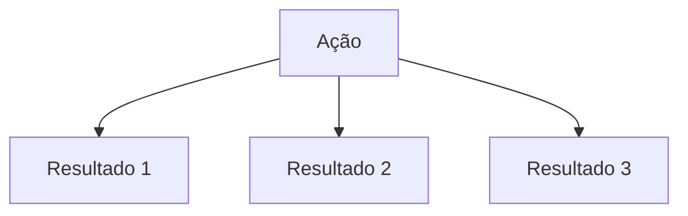

Uma solução deixa de ser apenas um caminho linear e pode assumir a forma de uma estratégia condicional.

```text
SE resultado 1 → faça X
SE resultado 2 → faça Y
```

As estruturas AND-OR ajudam a representar decisões em que uma ação precisa lidar com múltiplos resultados possíveis.

## 18. Estados de crença

Em ambientes parcialmente observáveis, o agente pode não saber exatamente em qual estado está.

Em vez de representar um único estado, pode representar um conjunto de estados possíveis:

```text
{estado 2, estado 5, estado 8}
```

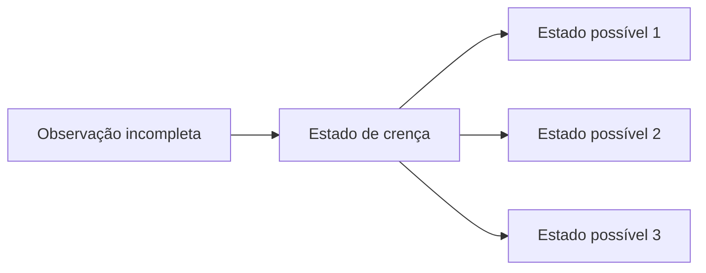

## 19. Busca online

Na busca offline, o agente pode planejar antes de agir.

Na busca online, planejamento e execução se alternam.

```mermaid
flowchart LR
    P[Planejar um passo] --> A[Agir]
    A --> O[Observar]
    O --> P
```

Isso é especialmente relevante quando o ambiente não é conhecido completamente de antemão.

## 20. Grande mapa de decisão

```mermaid
flowchart TD
    Q[Qual é o problema?] --> P1{Preciso de caminho?}
    P1 -->|sim| P2{Custos são uniformes?}
    P2 -->|sim| BFS[BFS pode ser adequada]
    P2 -->|não| P3{Tenho heurística?}
    P3 -->|não| UCS[UCS]
    P3 -->|sim| A[A* ou Gulosa conforme garantia desejada]
    P1 -->|não, quero otimizar estado| L{Busca local}
    L --> HC[Hill Climbing]
    L --> SA[Simulated Annealing]
    L --> BS[Beam Search]
    L --> GA[Algoritmo Genético]
```

## 21. Erros conceituais frequentes

> ⚠️ **"BFS é sempre ótima."** Apenas sob condições apropriadas de custo.

> ⚠️ **"DFS é incompleta em qualquer situação."** A propriedade depende do espaço e dos controles adotados.

> ⚠️ **"UCS escolhe o caminho com menos ações."** Ela escolhe o menor custo acumulado.

> ⚠️ **"Gulosa usa `g(n)+h(n)`."** Isso é A*; Gulosa usa `h(n)`.

> ⚠️ **"A* é sempre ótima independentemente da heurística."** A garantia depende das propriedades da heurística e da implementação.

> ⚠️ **"Hill Climbing e Busca Gulosa são a mesma coisa."** Gulosa é uma estratégia de busca em fronteira; Hill Climbing é busca local sobre vizinhança do estado atual.

> ⚠️ **"Random Restart muda o Hill Climbing internamente."** Ele repete a busca local a partir de diferentes estados iniciais.

## Revisão de 1 minuto

```text
Busca
├── não informada
│   ├── BFS → profundidade
│   ├── DFS → aprofundamento
│   └── UCS → g(n)
├── informada
│   ├── Gulosa → h(n)
│   └── A* → g(n)+h(n)
├── local
│   ├── Hill Climbing
│   ├── Simulated Annealing
│   ├── Beam Search
│   └── Algoritmo Genético
└── ambientes complexos
    ├── não determinismo
    ├── AND-OR
    ├── estados de crença
    └── busca online
```

## Checklist

- [ ] Consigo explicar a regra de seleção de BFS, DFS, UCS, Gulosa e A*.
- [ ] Diferencio profundidade, `g(n)`, `h(n)` e `f(n)`.
- [ ] Consigo explicar admissibilidade e consistência conceitualmente.
- [ ] Consigo escolher uma estratégia com base nas propriedades do problema.
- [ ] Diferencio busca clássica de busca local.
- [ ] Consigo explicar ótimo local, platô e reinício aleatório.
- [ ] Entendo a ideia de Simulated Annealing, Beam Search e Algoritmo Genético.
- [ ] Consigo explicar por que ambientes não determinísticos exigem soluções condicionais.
- [ ] Entendo estados de crença e a motivação da busca online.

**Próximo passo:** faça o [Estudo Guiado 04](../../estudos-guiados/04-busca/README.md), use a visualização interativa para observar a fronteira e depois resolva a atividade antes de iniciar o Trabalho 01.
