# Aula 05 - Lógica e Raciocínio em IA

> **Guia visual de revisão.** Use esta nota depois da aula para reorganizar os conceitos antes do estudo guiado e da atividade. O objetivo não é substituir os slides, mas transformar o conteúdo em um mapa de relações, mantendo o mesmo padrão das notas anteriores.

## Nota visual da aula

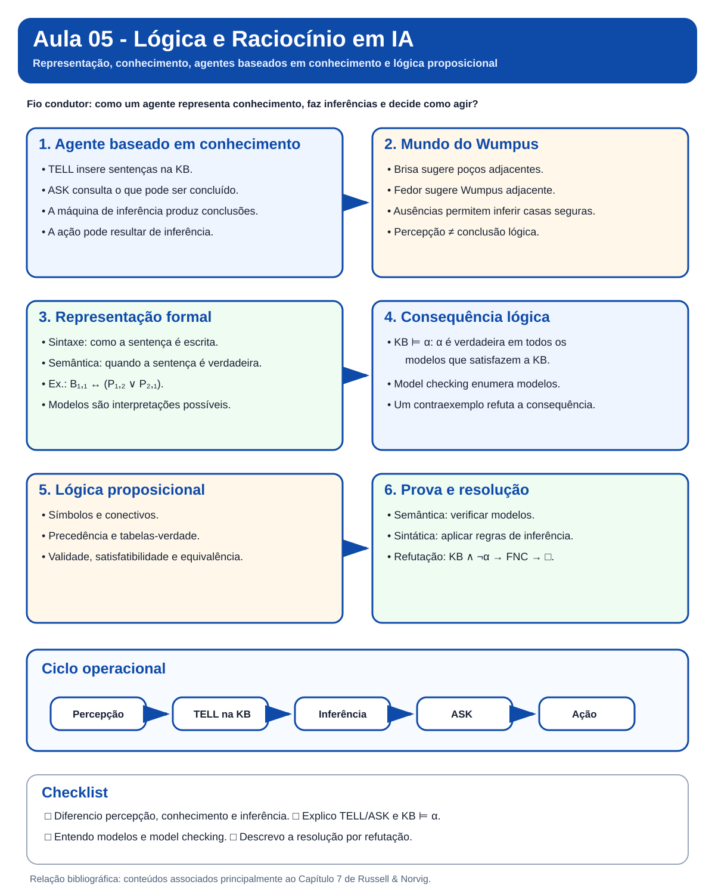

*Síntese visual dos principais conceitos da Aula 05. Use a figura para uma primeira revisão e, em seguida, percorra as seções abaixo para aprofundar cada conceito.*

## Visão em 30 segundos

| Pergunta | Ideia-chave |
|---|---|
| O que faz um agente baseado em conhecimento? | Mantém uma base de conhecimento e usa inferência para decidir como agir. |
| O que faz `TELL`? | Insere na KB uma sentença que representa uma percepção, fato ou ação. |
| O que faz `ASK`? | Consulta o que pode ser concluído a partir da KB. |
| Qual é o papel do Mundo do Wumpus? | Tornar visível a passagem de percepção para representação, inferência e ação. |
| O que é um modelo? | Uma interpretação possível dos símbolos da linguagem. |
| O que significa `KB ⊨ α`? | Toda interpretação que satisfaz a KB também satisfaz `α`. |
| Como provar uma conclusão? | Por verificação de modelos ou por regras de inferência, como resolução. |

## Mapa mental da aula

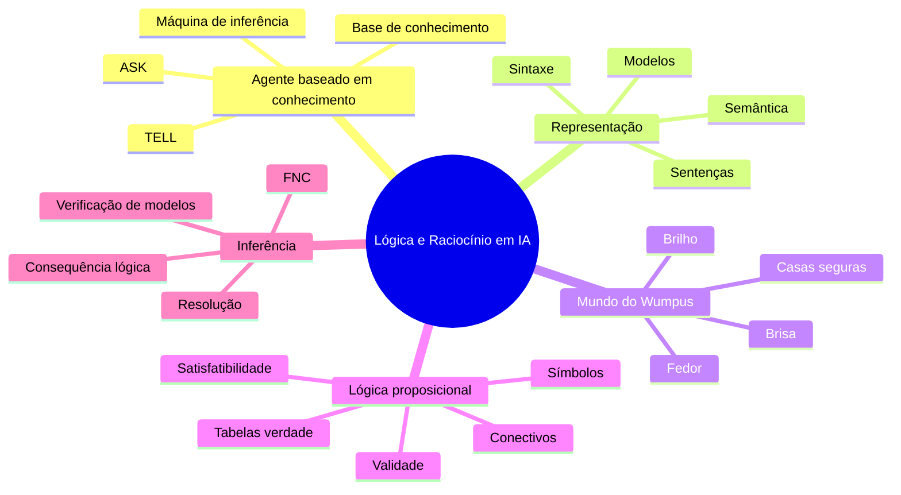

## 1. A pergunta central da aula

A Aula 05 responde à seguinte pergunta:

> **Como um agente pode representar conhecimento sobre o mundo e usá-lo para inferir novas informações antes de agir?**

O Mundo do Wumpus funciona como fio condutor porque permite observar toda a cadeia de raciocínio do agente.

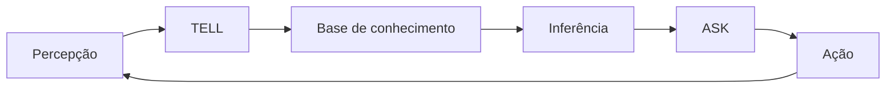

## 2. Retomando `TELL` e `ASK`

`TELL` e `ASK` já aparecem na discussão de agentes baseados em conhecimento. Nesta aula, a ideia é aprofundar **o que existe dentro da KB** e **como uma consulta pode ser respondida por inferência**.

| Operação | Papel |
|---|---|
| `TELL(KB, sentença)` | acrescenta conhecimento novo à KB |
| `ASK(KB, consulta)` | pergunta o que pode ser concluído a partir da KB |

Exemplo:

```text
Percepção em [1,1]: sem brisa e sem fedor
TELL(KB, não há brisa em [1,1])
TELL(KB, não há fedor em [1,1])
ASK(KB, "há uma casa segura adjacente?")
```

> **Ponto de atenção:** `ASK` não significa apenas recuperar algo que já estava explicitamente armazenado. A resposta pode depender de inferência.

## 3. Base de conhecimento e máquina de inferência

Uma base de conhecimento contém sentenças em uma linguagem formal. A máquina de inferência usa essas sentenças para produzir novas conclusões.

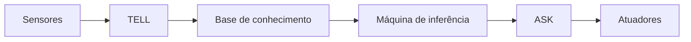

### Três níveis de descrição

| Nível | O que observamos |
|---|---|
| conhecimento | o agente "sabe" algo sobre o ambiente |
| lógico | esse conhecimento é expresso como sentenças |
| implementação | um programa manipula representações simbólicas |

## 4. Mundo do Wumpus como exemplo central

No Mundo do Wumpus, o agente recebe sinais locais e precisa inferir perigos que não consegue observar diretamente.

| Percepção | Significado local |
|---|---|
| `Breeze` | existe poço em alguma casa adjacente |
| `Stench` | existe Wumpus em alguma casa adjacente |
| `Glitter` | o ouro está na casa atual |
| `Bump` | houve colisão com a parede |
| `Scream` | o Wumpus foi atingido |

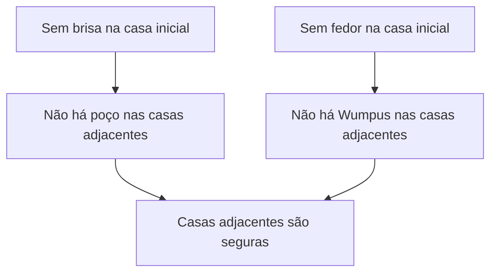

> **Percepção não é o mesmo que inferência.** O agente percebe a ausência de brisa. A conclusão de que uma casa adjacente é segura é uma consequência lógica.

## 5. Sintaxe e semântica

A distinção entre sintaxe e semântica é central.

| Conceito | Pergunta associada |
|---|---|
| Sintaxe | como escrever a sentença? |
| Semântica | quando essa sentença é verdadeira? |

Exemplo proposicional:

```text
B11 <-> (P12 ou P21)
```

- **Sintaxe:** a expressão precisa seguir as regras da linguagem.
- **Semântica:** precisamos definir em quais interpretações a sentença é verdadeira.

## 6. Modelos e mundos possíveis

Um modelo é uma interpretação possível para os símbolos de uma linguagem.

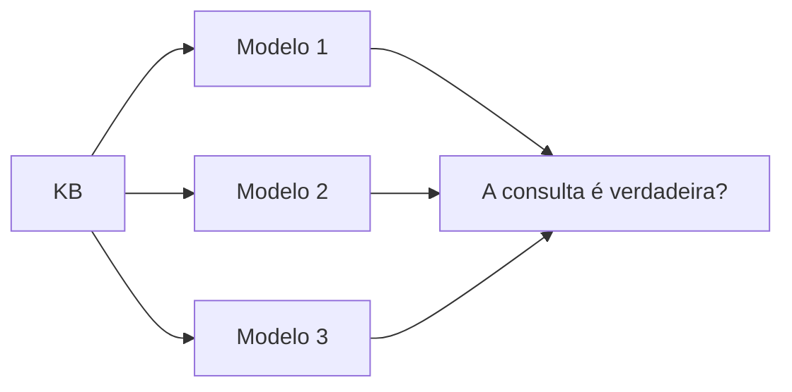

A KB restringe os mundos possíveis. Quanto mais conhecimento consistente é acrescentado, menos modelos permanecem compatíveis.

## 7. Consequência lógica

A notação:

```text
KB ⊨ α
```

significa que `α` é verdadeira em **todos os modelos** em que a KB é verdadeira.

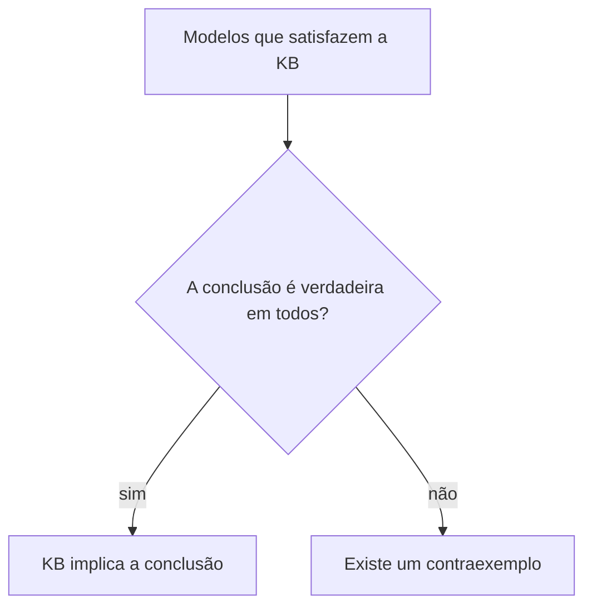

> **Erro comum:** encontrar um único modelo em que a conclusão é verdadeira não basta para demonstrar consequência lógica.

## 8. Lógica proposicional

A lógica proposicional trabalha com símbolos atômicos e conectivos.

| Símbolo | Leitura |
|---|---|
| `¬p` | não `p` |
| `p ∧ q` | `p` e `q` |
| `p ∨ q` | `p` ou `q` |
| `p ⇒ q` | se `p`, então `q` |
| `p ⇔ q` | `p` se e somente se `q` |

Precedência usual:

```text
¬  >  ∧  >  ∨  >  ⇒  >  ⇔
```

## 9. Validade, satisfatibilidade e equivalência

| Conceito | Significado |
|---|---|
| satisfatível | existe ao menos um modelo que torna a sentença verdadeira |
| insatisfatível | não existe modelo que torne a sentença verdadeira |
| válida | a sentença é verdadeira em todos os modelos |
| equivalente | duas sentenças possuem os mesmos modelos |

## 10. Verificação de modelos

A forma mais direta de verificar uma consequência lógica é enumerar modelos.

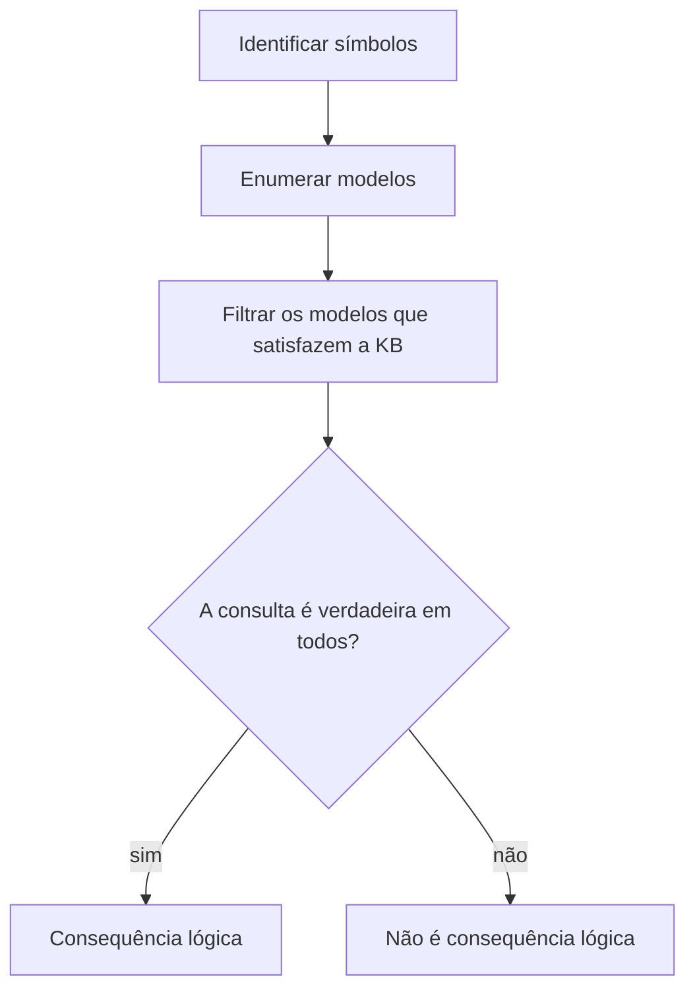

Com `n` símbolos proposicionais existem `2^n` interpretações possíveis. Por isso, o custo cresce rapidamente.

## 11. Prova como busca no espaço de inferências

Também podemos produzir uma prova como uma sequência de sentenças derivadas.

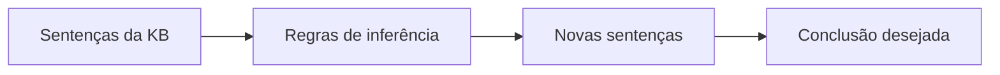

Essa visão conecta a Aula 05 ao conteúdo anterior de busca: o estado inicial contém a KB e as ações correspondem às regras de inferência aplicáveis.

## 12. Forma Normal Conjuntiva e resolução

Na resolução por refutação:

1. acrescentamos a negação da consulta à KB;
2. convertemos as sentenças para FNC;
3. aplicamos a regra de resolução;
4. se obtivermos a cláusula vazia, chegamos a uma contradição e a conclusão foi provada.

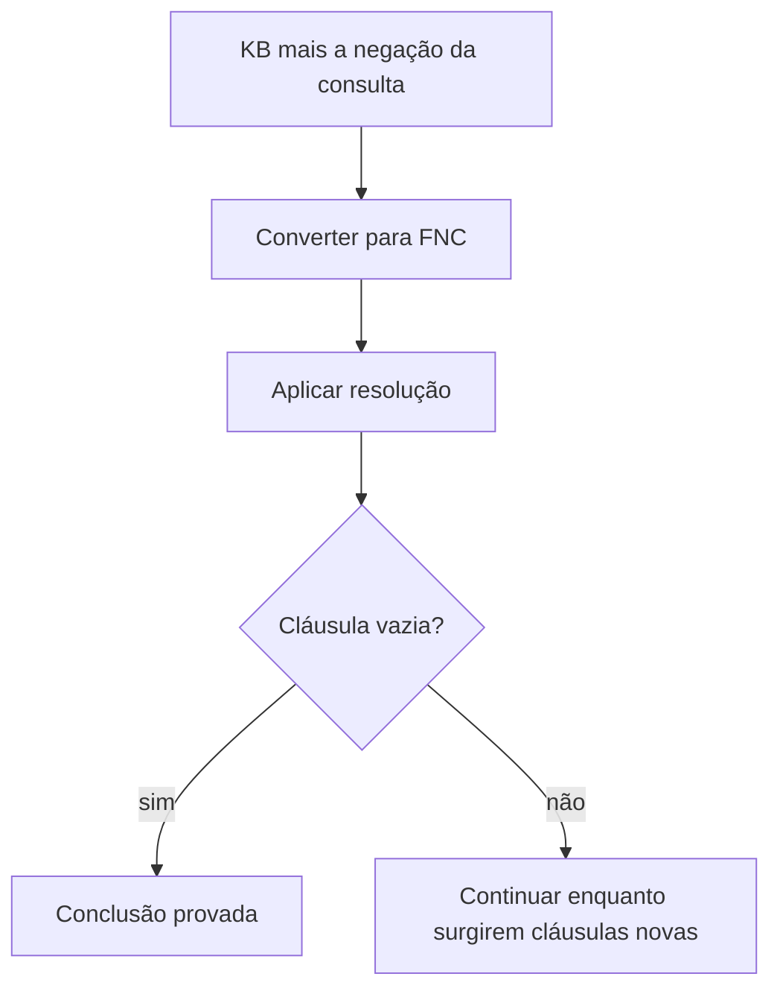

## 13. Conexões com as aulas anteriores

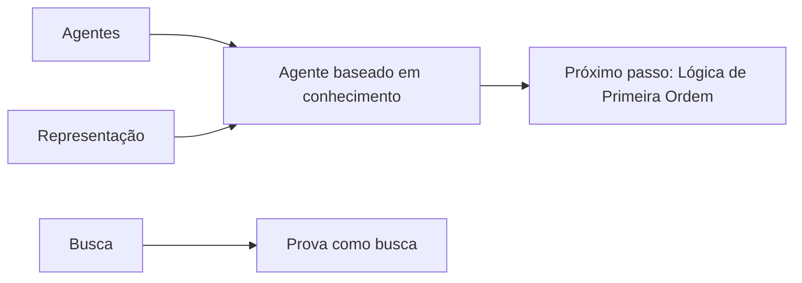

- **Agentes:** percepção, ação e racionalidade reaparecem no agente lógico.
- **Representação:** agora a representação ganha sintaxe e semântica formais.
- **Busca:** uma prova pode ser vista como busca em um espaço de inferências.
- **Próxima etapa:** a Lógica de Primeira Ordem amplia o poder de representação.

## 14. Erros conceituais frequentes

> **Erro 1:** perceber é o mesmo que concluir. Não. Percepções alimentam a KB; inferências produzem conclusões.

> **Erro 2:** modelo e mundo real são sinônimos. Não. Um modelo é uma interpretação formal possível.

> **Erro 3:** se `ASK` retorna algo, o agente observou diretamente aquilo. Não. A resposta pode ter sido inferida.

> **Erro 4:** validade e satisfatibilidade significam a mesma coisa. Não. Validade exige verdade em todos os modelos; satisfatibilidade exige ao menos um.

## Revisão de 1 minuto

```text
Lógica e Raciocínio em IA
├── agente baseado em conhecimento
│   ├── TELL
│   ├── ASK
│   ├── KB
│   └── máquina de inferência
├── representação formal
│   ├── sintaxe
│   ├── semântica
│   └── modelos
├── Mundo do Wumpus
│   ├── percepções locais
│   └── inferências sobre segurança e perigo
├── lógica proposicional
│   ├── conectivos
│   ├── tabelas-verdade
│   ├── validade
│   └── satisfatibilidade
└── inferência
    ├── consequência lógica
    ├── verificação de modelos
    ├── FNC
    └── resolução
```

## Checklist

- [ ] Consigo explicar o papel de `TELL` e `ASK`.
- [ ] Diferencio percepção, representação e inferência.
- [ ] Consigo interpretar as percepções do Mundo do Wumpus.
- [ ] Sei distinguir sintaxe e semântica.
- [ ] Entendo o que é um modelo.
- [ ] Consigo explicar o significado de `KB ⊨ α`.
- [ ] Diferencio validade, satisfatibilidade e equivalência.
- [ ] Entendo por que a verificação de modelos cresce exponencialmente.
- [ ] Consigo descrever a resolução por refutação.

**Próximo passo:** faça o [Estudo Guiado 05](../../estudos-guiados/05-logica/README.md), explore o [Mundo do Wumpus](../../visualizacoes/05-logica/wumpus/README.md) e revise os pseudocódigos da Aula 05.