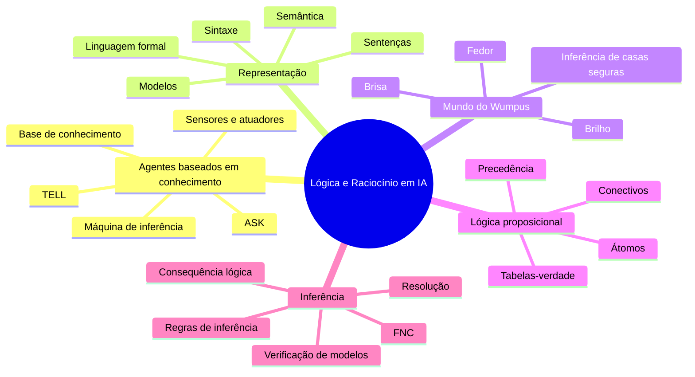
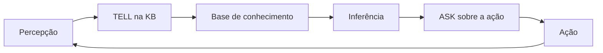
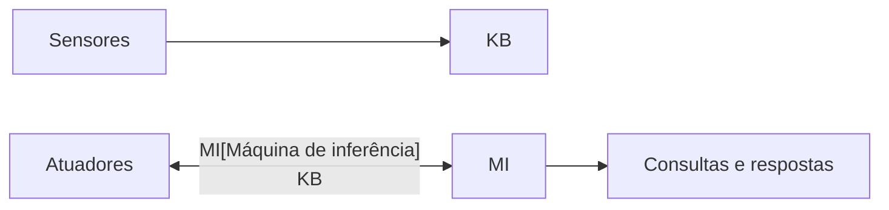
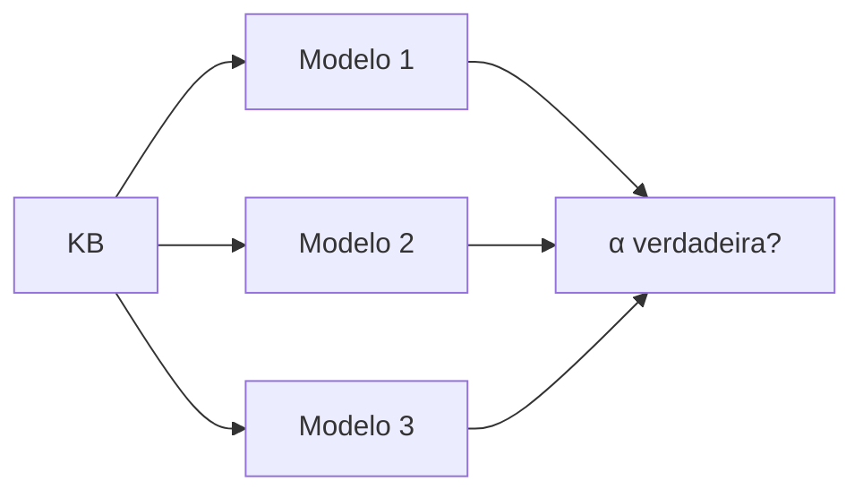
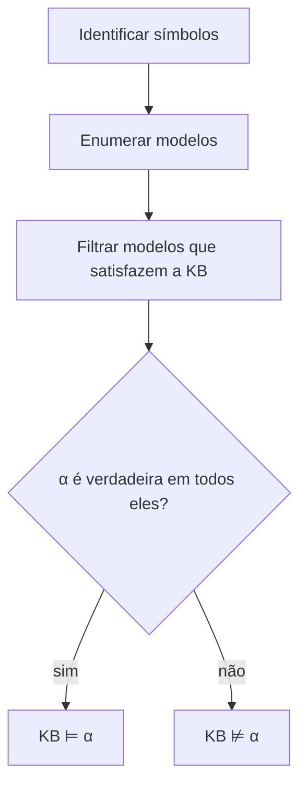
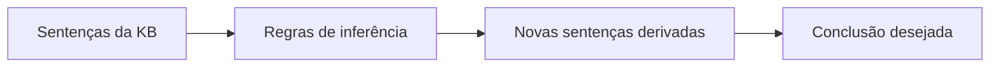
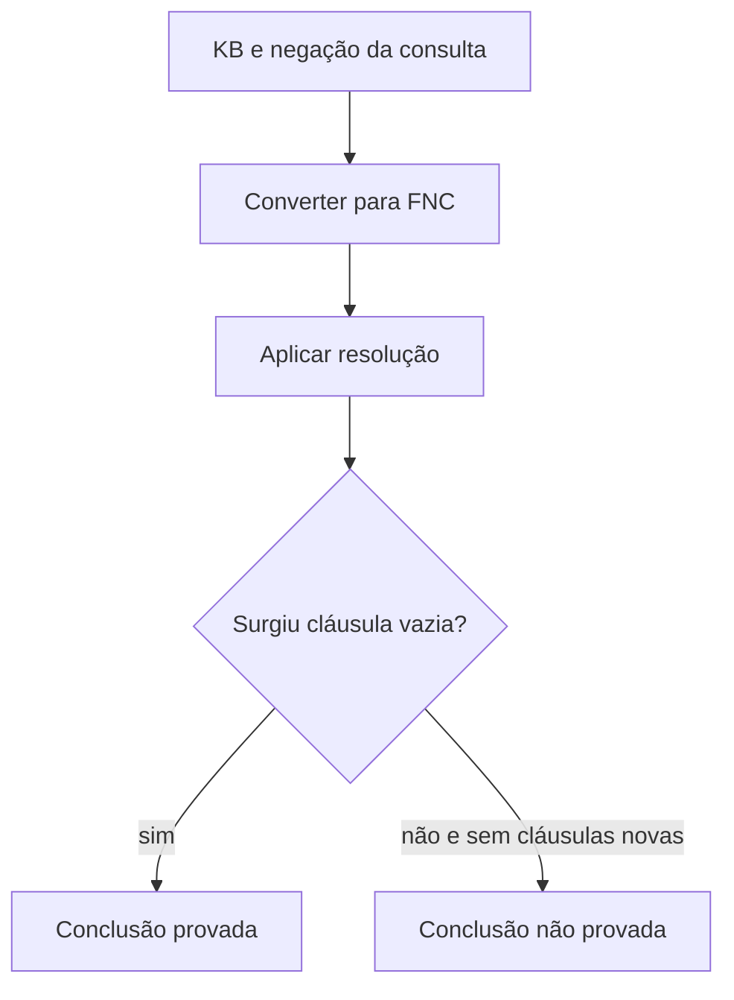

# Aula 05 - Lógica e Raciocínio em IA

> **Guia visual de revisão.** Esta nota organiza a Aula 05 em dois blocos complementares: (i) representação, conhecimento e agentes baseados em conhecimento e (ii) lógica proposicional como linguagem formal para representar fatos e realizar inferências. Use-a para conectar o ciclo `percepção -> TELL -> KB -> ASK -> ação` ao Mundo do Wumpus.

## Nota visual da aula


*Síntese visual dos principais conceitos da Aula 05. Faça uma leitura rápida da figura e, em seguida, use as seções abaixo para aprofundar as relações entre representação, modelos, consequência lógica e resolução.*

## Visão em 30 segundos

| Bloco | Ideia central |
|---|---|
| Agente baseado em conhecimento | armazena sentenças sobre o mundo e raciocina sobre elas |
| `TELL` | insere novas informações na base de conhecimento |
| `ASK` | consulta o que pode ser concluído a partir da base de conhecimento |
| Sintaxe | define como as sentenças são escritas |
| Semântica | define quando as sentenças são verdadeiras |
| Modelo | uma interpretação possível do mundo |
| Consequência lógica | `KB ⊨ α` significa que `α` é verdadeira em todos os modelos da KB |
| Verificação de modelos | decide consequência lógica enumerando modelos |
| FNC | forma adequada para aplicar resolução |
| Resolução | prova por refutação sem enumerar todos os modelos |

## Mapa mental da aula



## 1. A pergunta central da aula

A Aula 05 responde à seguinte pergunta:

> **Como um agente pode representar conhecimento sobre o mundo e usá-lo para inferir novas informações antes de agir?**

Essa pergunta liga a discussão de agentes à formalização lógica. O Mundo do Wumpus funciona como o fio condutor porque permite observar a passagem de **percepção** para **conhecimento representado** e, depois, para **inferência**.

## 2. Retomada de `TELL` e `ASK`

Na disciplina, `TELL` e `ASK` não aparecem como conceitos isolados. Eles são a interface operacional de um agente baseado em conhecimento.



| Operação | Papel |
|---|---|
| `TELL(KB, sentença)` | acrescenta conhecimento novo à KB |
| `ASK(KB, consulta)` | pergunta o que pode ser concluído a partir da KB |

### Exemplo intuitivo

```text
Percepção em [1,1]: sem brisa e sem fedor
TELL(KB, ¬B1,1)
TELL(KB, ¬S1,1)
ASK(KB, "Há casa segura adjacente?")
```

A partir das regras do domínio, o agente pode concluir que as casas adjacentes não contêm poço nem Wumpus.

## 3. Base de conhecimento e máquina de inferência

Uma base de conhecimento (KB) armazena sentenças em alguma linguagem formal. A máquina de inferência é o mecanismo que produz conclusões a partir dessas sentenças.



### Três níveis úteis de descrição

| Nível | O que observamos |
|---|---|
| conhecimento | o agente "sabe" algo sobre o ambiente |
| lógico | esse conhecimento vira sentenças |
| implementação | um programa manipula representações simbólicas |

## 4. Mundo do Wumpus como exemplo central

No Mundo do Wumpus, o agente percebe sinais locais e precisa inferir perigos não observáveis diretamente.

| Percepção | Significado local |
|---|---|
| `Breeze` | existe poço em alguma casa adjacente |
| `Stench` | existe Wumpus em alguma casa adjacente |
| `Glitter` | o ouro está na casa atual |
| `Bump` | houve colisão com a parede |
| `Scream` | o Wumpus foi atingido |

```mermaid
flowchart TD
    P1[Sem brisa em [1,1]] --> C1[Não há poço em casas adjacentes]
    P2[Sem fedor em [1,1]] --> C2[Não há Wumpus em casas adjacentes]
    C1 --> S[Casas adjacentes seguras]
    C2 --> S
```

> **Percepção não é o mesmo que inferência.** O agente percebe a ausência de brisa. A conclusão de que uma casa adjacente é segura é uma consequência lógica.

## 5. Sintaxe e semântica

A distinção entre sintaxe e semântica é central.

| Conceito | Pergunta associada |
|---|---|
| Sintaxe | como escrever a sentença? |
| Semântica | quando essa sentença é verdadeira? |

Exemplo proposicional:

```text
B1,1 ↔ (P1,2 ∨ P2,1)
```

- **Sintaxe:** a expressão usa conectivos e símbolos proposicionais válidos.
- **Semântica:** a sentença é verdadeira quando o valor de `B1,1` coincide com a disjunção `P1,2 ∨ P2,1`.

## 6. Modelos e mundos possíveis

Um modelo é uma interpretação possível para os símbolos de uma linguagem.



- cada modelo representa uma forma possível de o mundo ser;
- alguns modelos satisfazem a KB;
- outros violam a KB;
- uma sentença `α` é consequência lógica da KB se for verdadeira em **todos** os modelos que satisfazem a KB.

## 7. Consequência lógica

A notação `KB ⊨ α` significa que toda interpretação em que a KB é verdadeira também torna `α` verdadeira.

Se a KB contém:

```text
¬B1,1
B1,1 ↔ (P1,2 ∨ P2,1)
```

então podemos concluir `¬P1,2 ∧ ¬P2,1`.

## 8. Lógica proposicional: linguagem básica

| Símbolo | Leitura |
|---|---|
| `¬p` | não `p` |
| `p ∧ q` | `p` e `q` |
| `p ∨ q` | `p` ou `q` |
| `p ⇒ q` | se `p`, então `q` |
| `p ⇔ q` | `p` se e somente se `q` |

Precedência usual: `¬ > ∧ > ∨ > ⇒ > ⇔`.

## 9. Validade, satisfatibilidade e equivalência

| Conceito | Significado |
|---|---|
| satisfatível | existe ao menos um modelo que torna a sentença verdadeira |
| insatisfatível | não existe modelo que torne a sentença verdadeira |
| válida | a sentença é verdadeira em todos os modelos |
| equivalente | duas sentenças têm exatamente os mesmos modelos |

## 10. Verificação de modelos



Essa abordagem é correta e completa, mas cresce como `2^n` em função do número de símbolos proposicionais.

## 11. Da enumeração à prova

Em vez de verificar todos os modelos, também podemos produzir uma prova por regras de inferência.



## 12. Forma Normal Conjuntiva e resolução

1. adicionar `¬α` à KB;
2. converter `KB ∧ ¬α` para FNC;
3. aplicar a regra de resolução repetidamente;
4. se surgir a cláusula vazia `□`, então `KB ⊨ α`.



## 13. Erros conceituais frequentes

> ⚠️ **"Perceber é o mesmo que concluir."** Não. A percepção alimenta a KB; a inferência produz novas conclusões.

> ⚠️ **"Modelo" e "mundo real" são sinônimos.** Não. Modelo é uma interpretação formal possível.

> ⚠️ **"Se `ASK` retorna algo, então o agente observou diretamente isso."** Não. A resposta pode ter sido inferida.

> ⚠️ **"Validade" e "satisfatibilidade" significam a mesma coisa.** Não. Validade exige verdade em todos os modelos; satisfatibilidade exige ao menos um.

## Revisão de 1 minuto

```text
Lógica e Raciocínio em IA
├── agente baseado em conhecimento
│   ├── TELL
│   ├── ASK
│   ├── KB
│   └── máquina de inferência
├── representação
│   ├── sintaxe
│   └── semântica
├── Wumpus
│   ├── percepções locais
│   └── inferências sobre perigo e segurança
├── lógica proposicional
│   ├── átomos e conectivos
│   ├── modelos
│   ├── consequência lógica
│   └── tabelas-verdade
└── prova
    ├── verificação de modelos
    ├── FNC
    └── resolução
```

## Checklist

- [ ] Consigo explicar o papel de `TELL` e `ASK` em um agente baseado em conhecimento.
- [ ] Diferencio percepção, representação e inferência.
- [ ] Consigo interpretar percepções do Mundo do Wumpus.
- [ ] Sei distinguir sintaxe e semântica.
- [ ] Entendo o que é um modelo.
- [ ] Consigo explicar o significado de `KB ⊨ α`.
- [ ] Diferencio validade, satisfatibilidade e equivalência.
- [ ] Entendo por que a verificação de modelos é cara.
- [ ] Consigo descrever a ideia da resolução por refutação.

**Próximo passo:** faça o [Estudo Guiado 05](../../estudos-guiados/05-logica/README.md), explore a visualização do Mundo do Wumpus e revise os pseudocódigos da Aula 05.