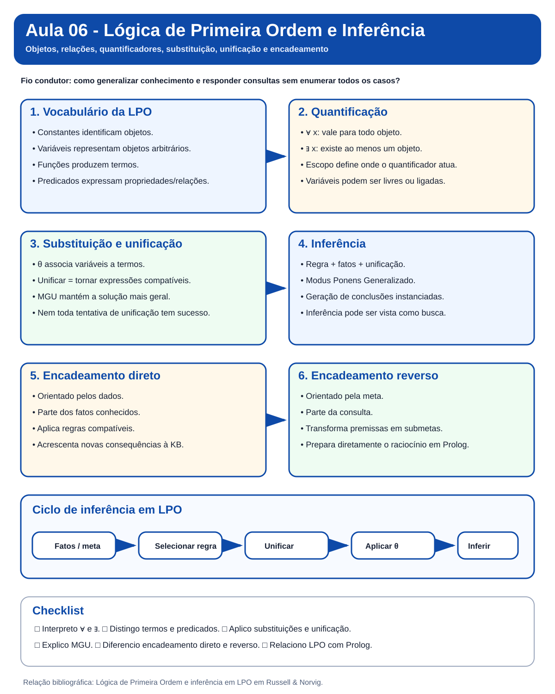
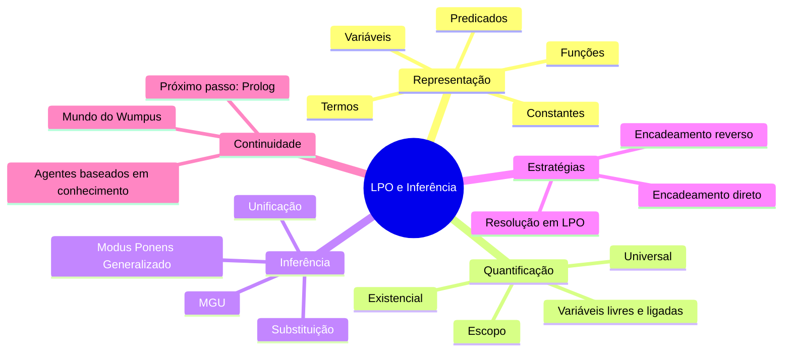
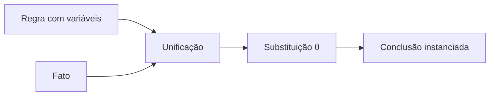

# Aula 06 - Lógica de Primeira Ordem e Inferência

> **Guia visual de revisão.** Esta nota dá continuidade à Aula 05. O foco agora é ampliar a capacidade de representação da lógica proposicional e tornar explícitos os mecanismos de inferência usados com variáveis, quantificadores, substituições e unificação.

## Nota visual da aula



## Visão em 30 segundos

| Pergunta | Ideia-chave |
|---|---|
| Por que a lógica proposicional não basta? | Porque não representa bem objetos, relações e regras gerais sem enumerar muitos símbolos. |
| O que a LPO acrescenta? | Constantes, variáveis, funções, predicados e quantificadores. |
| O que faz `∀`? | Expressa que uma sentença vale para todos os objetos do domínio. |
| O que faz `∃`? | Expressa que existe ao menos um objeto que satisfaz a sentença. |
| O que é substituição? | Aplicação sistemática de termos a variáveis. |
| O que é unificação? | Procura uma substituição que torne duas expressões compatíveis. |
| O que é MGU? | O unificador mais geral, sem restrições desnecessárias. |
| Como inferir em LPO? | Instanciando sentenças, unificando padrões e aplicando regras de inferência. |

## Mapa mental



## 1. Pergunta central

> **Como representar e inferir conhecimento sobre classes de objetos e relações sem enumerar proposições para cada caso?**

Na lógica proposicional, poderíamos ter:

```text
Humano_Socrates
Mortal_Socrates
Humano_Platao
Mortal_Platao
```

Na LPO:

```text
Humano(Socrates)
∀x Humano(x) → Mortal(x)
```

e então inferimos:

```text
Mortal(Socrates)
```

## 2. Vocabulário da LPO

| Elemento | Papel | Exemplo |
|---|---|---|
| constante | identifica um objeto específico | `Socrates`, `A11` |
| variável | representa um objeto arbitrário | `x`, `y` |
| função | produz um termo | `PaiDe(x)` |
| predicado | expressa propriedade ou relação | `Humano(x)`, `Adjacente(x,y)` |
| termo | designa um objeto | constante, variável ou função |
| sentença | fórmula sem variáveis livres | `∀x Humano(x) → Mortal(x)` |

## 3. Quantificadores

### Universal

```text
∀x Humano(x) → Mortal(x)
```

Leitura: para todo `x`, se `x` é humano, então `x` é mortal.

### Existencial

```text
∃x Professor(x) ∧ PesquisaIA(x)
```

Leitura: existe ao menos um objeto que é professor e pesquisa IA.

> **Atenção:** trocar `→` por `∧` em sentenças universais altera profundamente o significado.

## 4. Escopo e variáveis

Em:

```text
∀x (Humano(x) → Mortal(x))
```

`x` está ligada ao quantificador.

Em:

```text
Humano(x) → Mortal(x)
```

`x` está livre.

Uma sentença completa não possui variáveis livres.

## 5. Do Wumpus proposicional para LPO

Em vez de criar uma regra para cada casa, podemos representar relações de forma geral:

```text
∀x ∀y (Adjacente(x,y) ∧ Poco(y)) → Brisa(x)
```

Uma única regra passa a representar muitos casos particulares.

## 6. Instanciação e proposicionalização

A Parte II começa mostrando como sentenças quantificadas podem ser especializadas.

- **Instanciação Universal (IU):** obtém uma instância de uma sentença universal por substituição adequada.
- **Instanciação Existencial (IE):** introduz uma nova constante para representar algum objeto que satisfaz a sentença existencial.

Uma possibilidade é proposicionalizar a KB gerando instâncias sem variáveis e então aplicar inferência proposicional. O problema é que isso pode gerar muitas instâncias irrelevantes e, com funções, termos de profundidade crescente.

## 7. Substituição

Uma substituição associa variáveis a termos.

```text
θ = {x/Socrates}
```

Aplicando-a a:

```text
Humano(x) → Mortal(x)
```

obtemos:

```text
Humano(Socrates) → Mortal(Socrates)
```

## 8. Unificação

A unificação responde:

> **Que substituição torna duas expressões iguais?**

Exemplo:

```text
Conhece(x, Ada)
Conhece(Tiago, y)
```

Uma substituição possível:

```text
{x/Tiago, y/Ada}
```

Falha exemplo:

```text
Conhece(x, Ada)
Conhece(Tiago, Turing)
```

quando `Ada` e `Turing` são constantes distintas na mesma posição.

## 9. UMG

O **Unificador Mais Geral (UMG)**, também chamado *Most General Unifier (MGU)*, satisfaz as expressões impondo o mínimo de restrições necessário.

Antes de unificar regras diferentes, pode ser necessário **padronizar variáveis à parte** (*standardize apart*). A unificação também deve rejeitar associações como `x = f(x)` pelo **teste de ocorrência** (*occurs check*).

## 10. Modus Ponens Generalizado

```text
Humano(x) → Mortal(x)
Humano(Socrates)
```

A unificação encontra:

```text
{x/Socrates}
```

e permite concluir:

```text
Mortal(Socrates)
```



## 11. Cláusulas definidas e caso West

Cláusulas definidas têm exatamente um literal positivo e podem ser escritas como fatos ou regras. Elas sustentam os mecanismos de encadeamento trabalhados na aula.

O **caso West** é o exemplo condutor da Parte II: fatos sobre `American(West)`, `Missile(M1)`, `Sells(West,M1,Nono)` e `Enemy(Nono,America)` são combinados com regras para demonstrar `Criminal(West)`.

## 12. Encadeamento direto

É orientado pelos dados:

```text
fatos conhecidos
→ localizar regras aplicáveis
→ unificar premissas
→ gerar novos fatos
→ repetir
```

## 13. Encadeamento reverso

É orientado pela meta:

```text
consulta
→ localizar regra que conclua a meta
→ transformar premissas em submetas
→ tentar provar as submetas
```

Essa ideia prepara diretamente o estudo de Prolog. Quando há múltiplas alternativas de prova, o procedimento pode usar **retrocesso (backtracking)**, retornando ao último ponto de escolha após uma falha.

## 14. Comparação

| Aspecto | Encadeamento direto | Encadeamento reverso |
|---|---|---|
| orientação | dados | meta |
| início | fatos conhecidos | consulta |
| expansão | consequências | submetas |
| risco típico | inferências irrelevantes | ciclos/repetição de metas |
| relação com Prolog | indireta | direta |

## 15. Inferência como busca


No encadeamento reverso, cada estado pode ser entendido como um conjunto de submetas ainda não provadas.

## 16. Resolução em LPO

Como fechamento, a aula apresenta a resolução por refutação em LPO: negar a consulta, converter para FNC, padronizar variáveis, eliminar existenciais por **Skolemização**, unificar literais complementares e aplicar resolução até obter, quando possível, a cláusula vazia.

O foco da aula permanece em unificação e encadeamento; resolução aparece como fechamento e ponte conceitual.

## 17. Erros conceituais frequentes

> **Erro 1:** `∀` significa "existe um". Não. `∀` e `∃` têm semânticas distintas.

> **Erro 2:** unificar é substituir qualquer variável por qualquer termo. Não. A substituição precisa ser consistente.

> **Erro 3:** toda unificação tem sucesso. Não. Estruturas ou constantes incompatíveis produzem falha.

> **Erro 4:** encadeamento direto e reverso percorrem o mesmo caminho. Não. Eles exploram o espaço de inferências de maneiras distintas.

## Revisão de 1 minuto

```text
LPO e Inferência
├── representação
│   ├── constantes
│   ├── variáveis
│   ├── funções
│   └── predicados
├── quantificadores
│   ├── ∀ universal
│   └── ∃ existencial
├── mecanismos
│   ├── substituição
│   ├── unificação
│   └── MGU
└── inferência
    ├── Modus Ponens Generalizado
    ├── encadeamento direto
    └── encadeamento reverso
```

## Checklist

- [ ] Diferencio constante, variável, função e predicado.
- [ ] Interpreto `∀` e `∃`.
- [ ] Identifico variáveis livres e ligadas.
- [ ] Aplico substituições.
- [ ] Verifico unificações simples.
- [ ] Entendo o papel do UMG/MGU.
- [ ] Diferencio IU e IE.
- [ ] Entendo por que proposicionalizar toda a KB pode ser inviável.
- [ ] Reconheço padronização à parte e teste de ocorrência.
- [ ] Entendo o papel de cláusulas definidas e do caso West.
- [ ] Relaciono encadeamento reverso com retrocesso.
- [ ] Explico o Modus Ponens Generalizado.
- [ ] Diferencio encadeamento direto e reverso.
- [ ] Relaciono inferência em LPO com busca.
- [ ] Entendo a ideia de FNC, Skolemização e resolução em LPO.
- [ ] Entendo por que esse conteúdo prepara Prolog.

**Próximo passo:** faça o [Estudo Guiado 06](../../estudos-guiados/06-lpo-inferencia/README.md), explore as visualizações de [Unificação](../../visualizacoes/06-lpo-inferencia/unificacao/README.md) e [Inferência em LPO](../../visualizacoes/06-lpo-inferencia/inferencia/README.md), e revise os pseudocódigos da Aula 06.

**Referência principal:** Russell & Norvig, capítulos sobre Lógica de Primeira Ordem e inferência em LPO.
