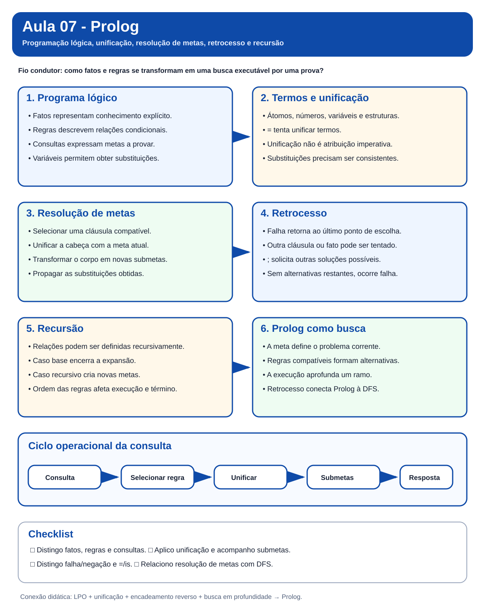
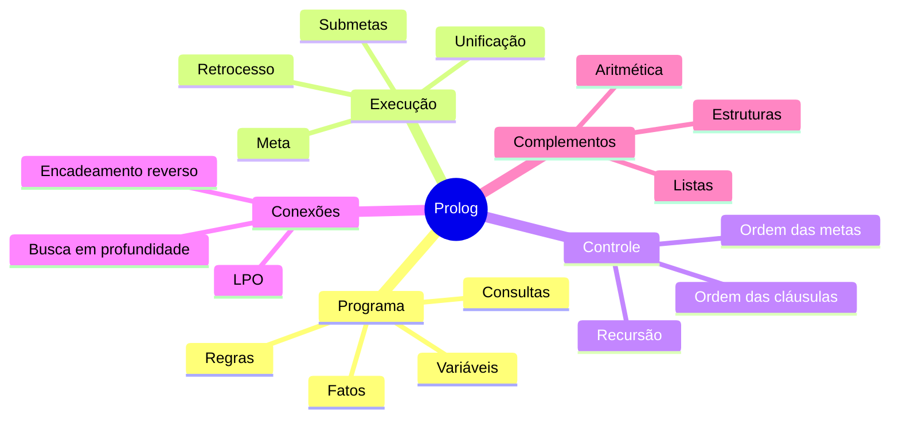
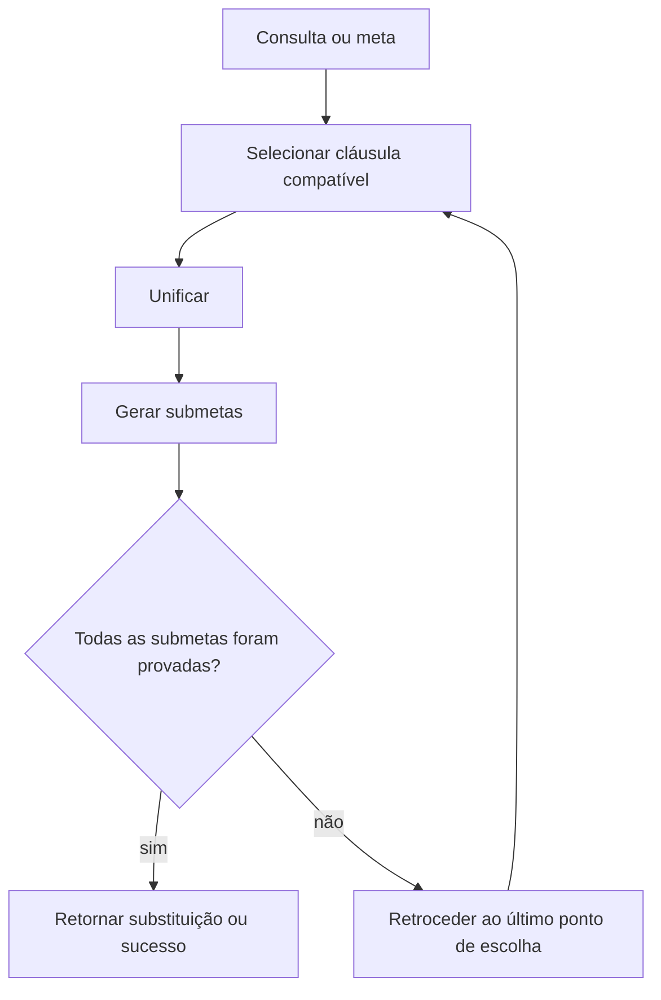
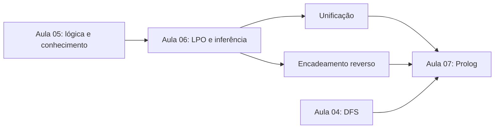

# Aula 07 - Prolog

> **Guia visual de revisão.** Esta nota fecha o bloco iniciado com Lógica Proposicional e Lógica de Primeira Ordem. O foco agora é compreender como fatos, regras, unificação, busca e retrocesso formam o modelo de execução de um programa Prolog.

## Nota visual da aula

## Visão em 30 segundos

| Pergunta | Ideia-chave |
|---|---|
| O que é Prolog? | Uma linguagem de programação lógica baseada em fatos, regras e consultas. |
| O que um programa descreve? | Relações que devem ser verdadeiras, em vez de uma sequência imperativa de comandos. |
| Como uma consulta é respondida? | Por busca de uma prova usando seleção de cláusulas, unificação e retrocesso. |
| O que faz a unificação? | Compatibiliza a meta atual com fatos ou cabeças de regras. |
| O que faz o retrocesso? | Retorna ao último ponto de escolha quando uma alternativa falha ou outra solução é solicitada. |
| Onde aparece busca? | A resolução de metas pode ser vista como exploração em profundidade de uma árvore de prova. |

## Mapa mental

## 1. Pergunta central

> **O que muda quando fatos, regras e mecanismos de inferência passam a constituir um programa executável?**

Na Aula 06, unificação e encadeamento reverso eram mecanismos de inferência. Em Prolog, eles passam a fazer parte do próprio modelo operacional da linguagem.

## 2. Programação declarativa

Em uma linguagem imperativa, normalmente descrevemos **como** executar operações. Em Prolog, descrevemos **relações** por meio de fatos e regras e formulamos consultas que o mecanismo de execução tenta provar.

    base de conhecimento (fatos + regras)
                    +
                 consulta
                    ↓
                unificação
                    ↓
             busca por uma prova
                    ↓
                 resposta

## 3. Fatos, regras e consultas

Fato:

    progenitor(ana, bruno).

Regra:

    avo(X, Z) :-
        progenitor(X, Y),
        progenitor(Y, Z).

Consulta:

    ?- progenitor(bruno, X).

Uma variável transforma a consulta em uma busca por substituições que tornam a meta verdadeira.

## 4. Termos e variáveis

| Tipo | Exemplo |
|---|---|
| átomo | `ana`, `azul`, `no_centro` |
| número | `3`, `4.5` |
| variável | `X`, `Pessoa`, `Resultado` |
| termo composto | `ponto(2,4)`, `progenitor(ana,bruno)` |

Variáveis começam com letra maiúscula ou sublinhado. Átomos normalmente começam com letra minúscula.

## 5. Unificação em Prolog

O operador `=` tenta unificar termos; ele não representa atribuição imperativa.

    ?- pessoa(X, 20) = pessoa(carla, Idade).
    X = carla,
    Idade = 20.

A unificação exige compatibilidade estrutural e consistência das substituições.

## 6. Consultas, múltiplas soluções e retrocesso

Com fatos como `progenitor(bruno, clara).` e `progenitor(bruno, diego).`, a consulta `?- progenitor(bruno, X).` pode retornar duas substituições. O ponto e vírgula solicita outra solução e o Prolog retrocede ao último ponto de escolha.

## 7. Regras e submetas

Uma regra pode decompor uma meta em outras metas. Para provar `avo(bruno, eva)`, por exemplo, o sistema precisa satisfazer as duas chamadas a `progenitor/2` com substituições consistentes.

## 8. Como Prolog tenta provar uma meta

## 9. Recursão

Relações transitivas podem ser expressas recursivamente:

    maior_que(X, Y) :- maior(X, Y).
    maior_que(X, Y) :- maior(X, Z), maior_que(Z, Y).

A segunda regra permite construir cadeias de relações intermediárias.

## 10. Prolog e busca em profundidade

A execução pode ser interpretada como uma árvore de prova: regras compatíveis geram alternativas, o corpo gera submetas, o sistema aprofunda uma alternativa e, em caso de falha, retorna ao último ponto de escolha. Essa estrutura conecta Prolog à Busca em Profundidade (DFS).

## 11. Ordem importa

Mesmo em uma linguagem declarativa, a execução possui uma leitura operacional. A ordem das cláusulas e a ordem das metas podem alterar desempenho, ordem das respostas e término.

## 12. Falha, desigualdade e negação por falha

Quando uma consulta falha, o Prolog informa que **não encontrou uma prova com o programa disponível**. Isso não equivale automaticamente a demonstrar a negação clássica da consulta.

O operador `\+` implementa **negação como falha (negation as failure)**:

    sem_filho(X) :- pessoa(X), \+ tem_filho(X).

A meta `\+ G` tem sucesso quando `G` não pode ser provada no contexto corrente.

Já `X \= Y` tem sucesso quando os termos não podem ser unificados. Esse operador aparece, por exemplo, ao formalizar irmãos distintos:

    irmaos(X,Y) :-
        progenitor(P,X),
        progenitor(P,Y),
        X \= Y.

> **Cuidado:** `\+` é um mecanismo operacional e não deve ser confundido com a negação clássica da LPO.

## 13. Aritmética, identidade e comparação numérica

Prolog distingue operações que parecem semelhantes:

    X = 1 + 2.      % unifica X com o termo 1+2
    X is 1 + 2.     % avalia a expressão e produz X = 3
    1 + 2 == 1 + 2. % testa identidade de termos
    1 + 2 =:= 3.    % avalia e compara valores numéricos

Portanto:

- `=` tenta unificar;
- `is` avalia a expressão aritmética à direita;
- `==` testa identidade entre termos sem instanciar variáveis;
- `=:=` compara valores numéricos após avaliação.

## 14. Estruturas e listas

Termos compostos permitem representar dados estruturados, como `ponto(3,4)` ou `data(22,setembro,2026)`.

Listas são estruturas recursivas:

    []
    [a,b,c]
    [Cabeca|Cauda]

Essa decomposição permite definições como:

    pertence(X,[X|_]).
    pertence(X,[_|Cauda]) :-
        pertence(X,Cauda).

Também aparecem no material complementar `ultimo/2`, `tamanho/2` e `concatena/3`, reforçando a ligação entre recursão, unificação e processamento de listas.

## 15. Conexões com as aulas anteriores

## 16. Erros conceituais frequentes

> **Erro 1:** `=` é atribuição. Não. Em Prolog, o operador tenta unificar termos.

> **Erro 2:** `false` significa que a afirmação é impossível no mundo real. Não. Significa que a meta não pôde ser provada com o programa corrente.

> **Erro 3:** a ordem nunca importa em uma linguagem declarativa. A leitura declarativa descreve relações, mas a execução possui uma ordem operacional.

> **Erro 4:** retrocesso e recursão são a mesma coisa. Não. Recursão define uma relação em termos dela mesma; retrocesso explora alternativas.

> **Erro 5:** `false` prova a negação clássica da consulta. Não. Indica que o mecanismo não encontrou uma prova com o programa disponível.

> **Erro 6:** `=`, `is`, `==` e `=:=` são equivalentes. Não. Eles realizam operações diferentes sobre termos e expressões numéricas.

## Revisão de 1 minuto

    Prolog
    ├── conhecimento: fatos e regras
    ├── consulta: meta e variáveis
    ├── execução: unificação, submetas, DFS e retrocesso
    └── programação: recursão, aritmética, estruturas e listas

## Checklist

- [ ] Diferencio fatos, regras e consultas.
- [ ] Identifico átomos, variáveis e termos compostos.
- [ ] Entendo `=` como unificação.
- [ ] Consigo prever respostas de consultas simples.
- [ ] Entendo o papel do ponto e vírgula e do retrocesso.
- [ ] Explico como uma regra transforma uma meta em submetas.
- [ ] Relaciono Prolog com encadeamento reverso.
- [ ] Relaciono a execução de Prolog com DFS.
- [ ] Reconheço o papel da recursão.
- [ ] Diferencio falha operacional de falsidade clássica.
- [ ] Entendo negação por falha com `\+`.
- [ ] Sei quando usar `\=`.
- [ ] Diferencio `=`, `is`, `==` e `=:=`.
- [ ] Interpreto listas por cabeça e cauda.
- [ ] Entendo por que a ordem das cláusulas e metas pode afetar a execução e o término.

**Próximo passo:** faça o [Estudo Guiado 07](../../estudos-guiados/07-prolog/README.md), explore a [visualização de resolução de metas](../../visualizacoes/07-prolog/resolucao-metas/README.md) e resolva as questões de Prolog da [Lista 05](../../atividades/).
