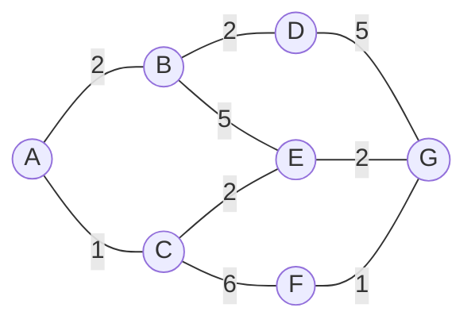

# Simulado 01

> **Orientações:** este simulado revisa os conteúdos das Aulas 01 a 04. Resolva primeiro sem consultar o material. Nas questões de busca, considere o teste de objetivo quando o nó for selecionado para expansão. Quando houver empate, use ordem alfabética. Tempo sugerido: 80 a 100 minutos.

## 1. Conceitos fundamentais

Defina, em 2 a 3 linhas cada:

- Inteligência Artificial;
- racionalidade;
- agente;
- estado de um problema;
- nó de uma árvore de busca.

Ao final, explique em uma frase por que estado e nó não são sinônimos.

## 2. Quatro perspectivas de IA

Relacione e diferencie as perspectivas:

- pensar como humanos;
- agir como humanos;
- pensar racionalmente;
- agir racionalmente.

Para duas delas, dê um exemplo de critério de avaliação que poderia ser usado em um sistema real.

## 3. Racionalidade e medida de desempenho

Um robô de entrega escolhe a rota B porque, no momento da decisão, seus sensores indicam menor tempo esperado. Após a saída, ocorre um bloqueio inesperado e a rota A termina sendo mais rápida.

A decisão original foi necessariamente irracional? Justifique usando os conceitos de informação disponível, desempenho esperado e onisciência.

## 4. PEAS e ambiente

Construa um PEAS completo para um robô de logística hospitalar que transporta medicamentos entre farmácia, enfermarias e postos de atendimento. Liste pelo menos 3 itens para cada componente.

Em seguida, classifique o ambiente quanto a:

- observabilidade;
- determinismo;
- natureza episódica/sequencial;
- dinâmica;
- discretização;
- número de agentes.

Justifique cada classificação.

## 5. Formulação de problema

Um robô móvel precisa sair da sala 101 e chegar ao laboratório 305 em um prédio. Algumas portas podem estar fechadas e cada corredor possui um custo estimado de deslocamento.

Formule o problema especificando:

- estado inicial;
- representação dos estados;
- ações;
- função sucessora/modelo de transição;
- teste de objetivo;
- custo de ação;
- custo de caminho.

Explique uma decisão de abstração que reduza o espaço de estados sem comprometer a meta.

## 6. Execução de busca não informada

Considere o grafo abaixo. O estado inicial é **A** e o objetivo é **G**. Os números nas arestas representam custos. Expanda sucessores em ordem alfabética.

Execute **BFS**, **DFS** e **Busca de Custo Uniforme (UCS)**. Para cada estratégia, registre:

- ordem de expansão;
- caminho encontrado;
- custo do caminho.

Depois responda: por que BFS e UCS podem retornar caminhos diferentes mesmo partindo do mesmo estado?

## 7. Heurísticas e busca informada

Explique:

1. o que representa `h(n)`;
2. o que significa uma heurística admissível;
3. a diferença entre Busca Gulosa e A*;
4. o que acontece com A* quando `h(n) = 0` para todos os nós;
5. por que encontrar o objetivo na fronteira não significa, em geral, que a busca deve encerrar imediatamente.

> **Autoavaliação:** ao terminar, marque os itens em que você ainda precisou "decorar" a resposta. Esses são os pontos que devem ser revistos antes do Simulado 02.