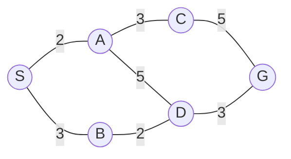

# Simulado 02

> **Orientações:** este simulado privilegia justificativa e análise de situações. Respostas sem justificativa devem ser consideradas incompletas. Tempo sugerido: 90 minutos.

## 1. Analise criticamente

Para cada afirmação, indique se ela é correta, incorreta ou depende de condições. Justifique.

1. "Todo programa complexo pode ser classificado como Inteligência Artificial."
2. "Se um agente obteve um resultado ruim, então agiu irracionalmente."
3. "BFS sempre encontra a solução de menor custo."
4. "A* sempre é ótima, independentemente da heurística."

## 2. ChatGPT como agente

Compare dois cenários:

- **Cenário A:** um modelo recebe uma mensagem e apenas produz texto;
- **Cenário B:** um sistema recebe uma meta, consulta documentos, chama ferramentas, verifica resultados e decide próximos passos.

Para cada cenário, identifique ambiente, percepções, ações e grau de autonomia. Discuta se a descrição como agente é adequada e por quê.

## 3. Encontre os erros no PEAS

Um aluno propôs o seguinte PEAS para um veículo autônomo:

- **P** = câmera, GPS e radar;
- **E** = volante, freio e acelerador;
- **A** = segurança, tempo de viagem e conforto;
- **S** = ruas, pedestres e outros veículos.

Identifique os erros conceituais, reorganize os itens e acrescente pelo menos dois elementos que estejam faltando.

## 4. Representação e abstração

Um sistema de navegação de campus pode representar o ambiente de duas formas:

- **I:** coordenadas contínuas de todos os pontos;
- **II:** grafo contendo prédios, entradas e caminhos principais.

Compare as duas representações quanto a tamanho do espaço de estados, nível de detalhe e adequação. Dê um exemplo de meta para a qual a representação II é suficiente e outro em que ela pode ser insuficiente.

## 5. Escolha a estratégia

Para cada cenário, indique uma estratégia inicial plausível entre **BFS, DFS, UCS, Gulosa e A***, justificando com as propriedades do problema.

1. Todas as ações possuem custo 1 e deseja-se a solução mais rasa.
2. A memória é muito limitada e qualquer solução é aceitável.
3. Os custos variam bastante e não há heurística disponível.
4. Existe uma heurística barata; rapidez é mais importante do que garantia de menor custo.
5. Existe uma heurística adequada e o custo final da solução é importante.

## 6. Admissibilidade e consistência

Considere o grafo e a heurística abaixo, com objetivo **G**.

| Nó | S | A | B | C | D | G |
|---|---:|---:|---:|---:|---:|---:|
| `h(n)` | 7 | 6 | 4 | 4 | 2 | 0 |

1. Verifique se a heurística é admissível.
2. Verifique a consistência nas arestas.
3. Se `h(B)` fosse alterado para 6, o que mudaria? Justifique.

## 7. Execute e compare

No mesmo grafo da questão 6, execute **Busca Gulosa** e **A***. Registre:

- ordem de expansão;
- valores usados para priorização;
- caminho final.

Explique por que os dois algoritmos podem expandir nós em ordens diferentes mesmo usando a mesma heurística.

> **Autoavaliação:** se você consegue nomear o algoritmo, mas não consegue justificar por que ele se adequa ao cenário, a revisão ainda não está concluída.