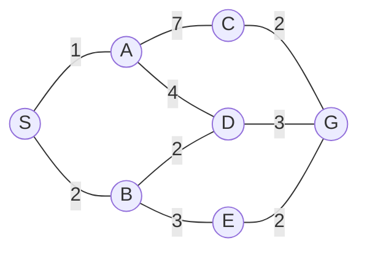
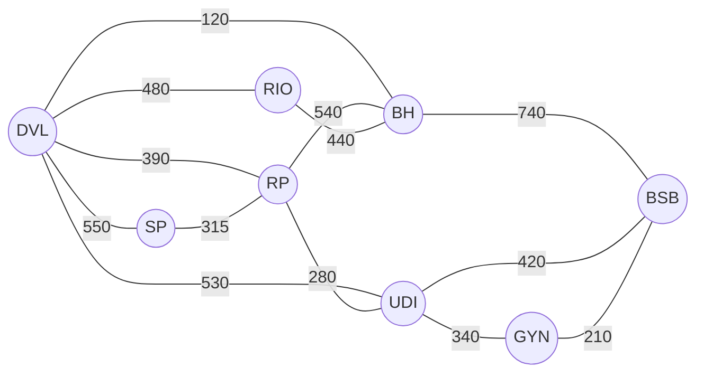

# Simulado 03

> **Orientações:** resolva como se fosse a prova real: sem consulta, em até 100 minutos. A interpretação faz parte da avaliação. Nas buscas, o teste de objetivo ocorre quando o nó é selecionado para expansão. Em empates, use ordem alfabética.

## 1. Conceitos integrados

Explique, de forma concisa e integrada, os conceitos de **Inteligência Artificial**, **agente**, **racionalidade** e **medida de desempenho**.

Em seguida, diferencie "agir racionalmente" de "agir como um humano" usando um exemplo.

## 2. Agente e ambiente

Um drone de inspeção de linhas de transmissão deve percorrer uma rota, registrar imagens, detectar situações de risco e retornar à base com energia suficiente.

1. Desenvolva um PEAS com pelo menos 3 itens por componente.
2. Classifique o ambiente em pelo menos quatro dimensões estudadas.
3. Indique uma arquitetura de agente adequada e justifique.

## 3. Formulação de problema

Um sistema deve organizar quatro caixas A, B, C e D em três posições de armazenamento. Apenas a caixa do topo de uma pilha pode ser movida, e cada movimento transfere uma caixa para o topo de outra pilha. O objetivo é atingir uma configuração final especificada.

Formule o problema com precisão suficiente para implementação:

- estado inicial;
- representação dos estados;
- ações;
- função sucessora;
- teste de objetivo;
- custo.

Diferencie, no contexto desse problema, **estado**, **nó** e **árvore de busca**.

## 4. Comparação das estratégias

Compare **BFS, DFS, UCS, Busca Gulosa e A*** quanto ao critério de seleção da fronteira. Para cada uma, indique quando seria uma escolha razoável.

Inclua as condições relevantes para discutir otimalidade de BFS, UCS e A*.

## 5. Busca não informada

Considere o grafo abaixo, com **S** como estado inicial e **G** como objetivo. Custos estão nas arestas.

Execute **BFS, DFS e UCS**, registrando:

- ordem de expansão;
- caminho encontrado;
- custo.

Em seguida, explique por que "primeiro caminho encontrado" e "caminho de menor custo" não são conceitos equivalentes.

## 6. Mapa do Brasil - busca informada

O grafo a seguir é um modelo didático inspirado em cidades brasileiras. Os custos das arestas foram definidos para o exercício e **não representam distâncias rodoviárias oficiais**. O objetivo é sair de **Divinópolis (DVL)** e chegar a **Brasília (BSB)**.

As siglas usadas no grafo correspondem às seguintes cidades:

| Sigla | Cidade | UF |
|---|---|---|
| DVL | Divinópolis | MG |
| BH | Belo Horizonte | MG |
| UDI | Uberlândia | MG |
| RP | Ribeirão Preto | SP |
| GYN | Goiânia | GO |
| SP | São Paulo | SP |
| RIO | Rio de Janeiro | RJ |
| BSB | Brasília | DF |

| Cidade | DVL | BH | UDI | RP | GYN | SP | RIO | BSB |
|---|---:|---:|---:|---:|---:|---:|---:|---:|
| `h(n)` até BSB | 670 | 620 | 350 | 520 | 170 | 870 | 930 | 0 |

Execute, passo a passo, **Busca Gulosa** e **A***. Para cada expansão, registre o nó atual e os valores de prioridade relevantes. Informe o caminho e o custo final.

Por fim, responda: a heurística fornecida parece admissível e consistente em relação aos custos do grafo? Justifique pelo menos com dois exemplos de arestas.

> **Autoavaliação:** antes de consultar novamente o material, indique quais questões você deixaria incompletas se esta fosse uma avaliação.